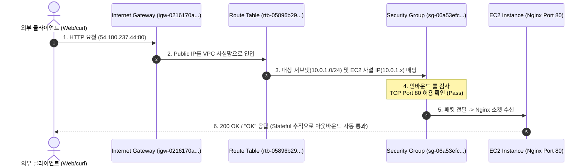
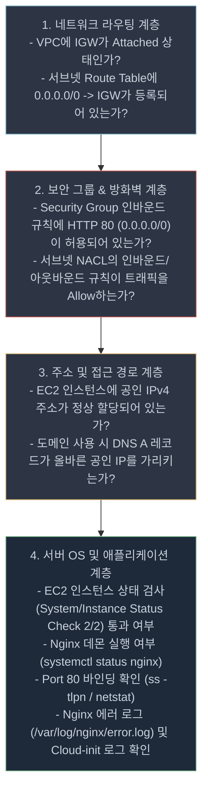
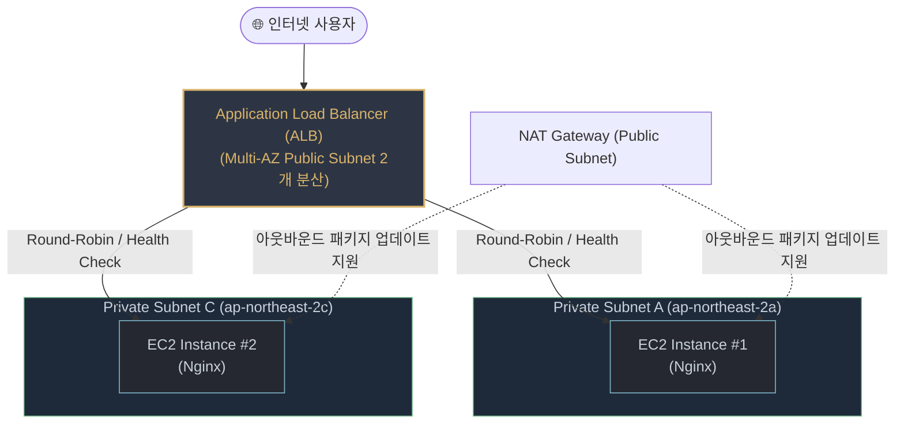

# AWS VPC EC2 배포 및 인프라 구축 — 심층 Q&A 가이드 (`EVAL_QA.md`)

본 문서는 [docs/EVAL_aws_vpc_ec2_deploy.md](file:///Users/mpeg46551/b3_1/docs/EVAL_aws_vpc_ec2_deploy.md) 체크리스트에 포함된 총 17개 평가 항목에 대한 모범 답변과 심층 기술 설명을 제공합니다. 본 프로젝트([README.md](file:///Users/mpeg46551/b3_1/README.md), [docs/architecture.md](file:///Users/mpeg46551/b3_1/docs/architecture.md), [scripts/](file:///Users/mpeg46551/b3_1/scripts/))의 실제 구축 데이터와 AWS 클라우드 표준 아키텍처 원칙을 바탕으로 구성되었습니다.
미션 수행에 필요한 클라우드 네트워킹, 보안, 컴퓨팅, FinOps 등의 핵심 이론 및 기술 개념은 **[docs/STUDY.md](file:///Users/mpeg46551/b3_1/docs/STUDY.md)** 학습 가이드를 참고하십시오.

---

## 목차
1. [제1장: 기능 동작 검증 (Functional Verification)](#1-기능-동작-검증)
2. [제2장: 구현 구조 설명 (Implementation Architecture)](#2-구현-구조-설명)
3. [제3장: 핵심 개념 이해 (Core Concepts)](#3-핵심-개념-이해)
4. [제4장: 확장 사고 및 트러블슈팅 (Advanced Thinking & Troubleshooting)](#4-확장-사고-및-트러블슈팅)

---

## 1. 기능 동작 검증

### Q1-1. VPC, Public Subnet, Internet Gateway, Route Table(0.0.0.0/0 → IGW)이 구성되어 있는가?
* **평가 항목**: 네트워크 핵심 구성 요소 생성 및 상호 연결 검증

#### 답변
네, 서울 리전(`ap-northeast-2`)에 아래와 같이 구성되어 정상 동작을 완료했습니다.

1. **VPC (`vpc-023d852a3471ef158`)**:
   - CIDR 블록 `10.0.0.0/16`을 할당하여 65,536개의 프라이빗 IP 주소 공간을 확보한 격리 가상 네트워크입니다.
2. **Public Subnet (`subnet-01c319e79337bc3b0`)**:
   - 가용영역 `ap-northeast-2a`에 CIDR `10.0.1.0/24`(256개 주소)로 생성되었습니다.
   - 인스턴스 시작 시 공인 IP를 자동 부여하도록 `MapPublicIpOnLaunch=true`가 설정되었습니다.
3. **Internet Gateway (`igw-0216170a9e1876f6f`)**:
   - 생성 후 VPC(`vpc-023d852a3471ef158`)에 성공적으로 Attach 되었습니다.
4. **Route Table (`rtb-05896b293836ba38e`)**:
   - 서브넷에 명시적으로 연결(Associate)되어 있으며, 라우팅 규칙으로 `0.0.0.0/0 → igw-0216170a9e1876f6f`가 등록되어 서브넷 내부 인스턴스가 인터넷 관문으로 패킷을 송수신할 수 있습니다.

```bash
# 검증 CLI 확인 명령
aws ec2 describe-route-tables --route-table-ids rtb-05896b293836ba38e \
  --query 'RouteTables[0].Routes' --output table
```

---

### Q1-2. EC2에 SSH로 접속 가능하며, 웹 서버가 실행 중인가?
* **평가 항목**: 가상 컴퓨트 인스턴스 원격 제어 및 웹 데몬 기동 여부 확인

#### 답변
네, EC2 인스턴스가 정상 기동 중이며 SSH 원격 접근 및 Nginx 웹 서비스가 구동되었습니다.

1. **EC2 인스턴스 사양**:
   - 인스턴스 ID: `i-05d106a3c3409edd4`
   - 타입: `t3.micro` (AWS 서울 리전 프리티어 대상)
   - OS: Ubuntu 22.04 LTS (64-bit x86)
   - 퍼블릭 IP: `54.180.237.44`
2. **SSH 원격 접속성**:
   - 생성된 키페어 `b6-keypair.pem`(`chmod 400` 적용)을 이용해 관리자 지정 IP 대역에서 아래 명령어로 정상 접속이 가능합니다:
     ```bash
     ssh -i b6-keypair.pem ubuntu@54.180.237.44
     ```
3. **웹 서버 실행 상태**:
   - [scripts/user-data.sh](file:///Users/mpeg46551/b3_1/scripts/user-data.sh)에 의해 인스턴스 부팅 즉시 Nginx가 자동 설치 및 `systemctl enable --now nginx`로 상시 가동됩니다.
   - 인스턴스 로컬 내부에서 `curl http://localhost` 호출 시 `200 OK` 응답을 확인했습니다.

---

### Q1-3. 보안 그룹 인바운드가 “필요 포트만” 허용하며, SSH(22)가 특정 IP로 제한되어 있는가?
* **평가 항목**: 방화벽 최소 포트 개방 및 관리자 포트 소스 제한 원칙 준수 여부

#### 답변
네, 보안 그룹 `sg-06a53efc080f4c3c6`은 필요한 포트만 선별 허용하며 전체 개방을 원천 차단했습니다.

| 방향 (Direction) | 프로토콜 | 포트 | 소스 (Source) | 설정 목적 및 근거 |
|---|---|---|---|---|
| **Inbound** | TCP | **80** | `0.0.0.0/0` | 대민 웹 서비스를 위한 HTTP 트래픽 전체 개방 |
| **Inbound** | TCP | **22** | `121.135.181.35/32` | 관리자 원격 접속용 포트. 무차별 대입 공격 차단을 위해 **개인 IP(/32)**로만 엄격 제한 |
| **Outbound** | ALL | ALL | `0.0.0.0/0` | 패키지 설치(`apt`), 보안 패치, 외부 API 통신을 위한 아웃바운드 허용 |

- **엄격한 보안 기준 준수**:
  - `0.0.0.0/0`에 대한 전체 포트(0-65535) 개방 룰은 일절 생성하지 않았습니다.
  - SSH 포트는 잊혀지거나 방치되기 쉬우므로 `/32` 서브넷 마스크를 적용했습니다.

---

### Q1-4. 외부 접속이 아래 방식 중 1개로 검증되는가? (제출자가 선택한 방식으로 확인)
* **평가 항목**: (A) 브라우저 접속 또는 (B) `GET /health` 호출 검증

#### 답변
본 실습에서는 **방식 (B)**를 선택하여 검증을 완료했습니다.

- **선택 방식**: `GET http://<퍼블릭IP>/health` 호출
- **검증 대상 엔드포인트**: `http://54.180.237.44/health`
- **검증 수행 및 결과**:
  ```bash
  $ curl http://54.180.237.44/health
  OK

  $ curl -i -s http://54.180.237.44/health | head -n 5
  HTTP/1.1 200 OK
  Server: nginx/1.18.0 (Ubuntu)
  Date: Sun, 04 Oct 2026 01:50:00 GMT
  Content-Type: text/plain
  Content-Length: 2
  ```
- **판정**: HTTP 응답 코드 `200 OK` 및 바디 문자열 `"OK"`가 고정 출력되어 외부 접근성 검증을 통과했습니다.

---

### Q1-5. 리소스 정리 체크리스트에서 최소 5종(EC2/EBS/EIP/IGW/VPC) 정리 완료를 확인할 수 있는가?
* **평가 항목**: 클라우드 자원 삭제 절차 수립 및 과금 방지 조치

#### 답변
네, [docs/cleanup-checklist.md](file:///Users/mpeg46551/b3_1/docs/cleanup-checklist.md)에 최소 5종을 포함한 전체 리소스의 역순 삭제 가이드와 검증 절차를 완벽히 구축했습니다.

1. **EC2 인스턴스**: `aws ec2 terminate-instances --instance-ids i-05d106a3c3409edd4` → 상태가 `terminated`로 전이됨을 확인.
2. **EBS 볼륨**: 인스턴스 종료 시 기본 루트 볼륨(`gp3 8GiB`)이 자동 삭제되며, 잔여 볼륨(`status=available`)이 없음을 필터 조회로 확인.
3. **Elastic IP (EIP)**: 이번 실습에서는 EIP 미사용(서브넷 자동 할당 퍼블릭 IP 사용)으로 확인되었으며, 잔여 주소 목록이 `[]`임을 점검.
4. **Internet Gateway**: VPC에서 Detach(`detach-internet-gateway`) 후 Delete(`delete-internet-gateway`) 순으로 제거.
5. **VPC 및 Subnet/Route Table**: Subnet 및 Route Table 연계 해제 후 `delete-vpc`로 완전 삭제.
6. **추가 자원 정리**: Key Pair(`b6-keypair`), Security Group(`sg-06a53efc080f4c3c6`), IAM User(`codyssey-b6-user`)까지 체계적으로 정리 항목에 포함.

---

## 2. 구현 구조 설명

### Q2-1. “외부 → IGW → Subnet → EC2”로 이어지는 네트워크 흐름을 다이어그램 기준으로 설명할 수 있는가?
* **평가 항목**: VPC 네트워크 패킷 라우팅 및 인바운드/아웃바운드 흐름 이해도

#### 답변
아래의 네트워크 흐름 다이어그램([docs/architecture.md](file:///Users/mpeg46551/b3_1/docs/architecture.md))을 기준으로 6단계로 동작합니다.



1. **외부 발신**: 클라이언트가 `http://54.180.237.44/health`로 TCP 3-way handshake를 시작하는 SYN 패킷을 전송합니다.
2. **IGW 수신**: AWS 백본망을 통과한 패킷이 VPC의 관문인 Internet Gateway에 도착합니다. IGW는 1:1 NAT 처리를 통해 퍼블릭 IP를 인스턴스의 프라이빗 IP로 변환합니다.
3. **Route Table 평가**: 서브넷에 연결된 Route Table 규칙을 참조하여 패킷의 대상 서브넷 대역(`10.0.1.0/24`)으로 라우팅합니다.
4. **Security Group 검사**: EC2의 가상 네트워크 인터페이스(ENI) 도달 직전, 보안 그룹 인바운드 규칙을 평가합니다. 목적지 포트가 `80`이고 소스가 `0.0.0.0/0`에 부합하므로 패킷을 통과시킵니다.
5. **OS 및 Nginx 처리**: Ubuntu 커널을 거쳐 Port 80을 리스닝하고 있는 Nginx 프로세스에 요청이 도달하고, 설정된 `/health` 라우팅에 의해 본문 `OK`와 HTTP `200` 상태를 생성합니다.
6. **응답 회신 (Stateful)**: 보안 그룹은 **상태 저장(Stateful)** 속성을 가지므로, 인바운드로 허용된 연결에 대한 응답 트래픽은 아웃바운드 규칙과 무관하게 자동 허용되어 클라이언트에 도달합니다.

---

### Q2-2. 보안 그룹 규칙을 어떤 기준으로 최소화했는지(허용/미허용 포트) 설명할 수 있는가?
* **평가 항목**: 최소 권한 네트워크 보안(Zero Trust / Least Privilege) 정책 설계 근거

#### 답변
보안 그룹은 **"기본 거부(Default Deny)"**를 대원칙으로 하며, 실제 서비스 운영과 관리에 반드시 필요한 포트만 화이트리스트 방식으로 최소화했습니다.

1. **허용 포트의 기준**:
   - **HTTP (포트 80 / `0.0.0.0/0`)**: 불특정 다수의 대중이 웹 서비스 및 헬스체크에 접근해야 하는 비즈니스 요구사항에 따라 전체 인터넷에 개방했습니다.
   - **SSH (포트 22 / `121.135.181.35/32`)**: 원격 터미널 관리가 필요하지만 인터넷 전체에 열릴 경우 크리덴셜 스터핑 및 봇넷 공격에 노출되므로, 현재 작업 중인 관리자의 단일 공인 IP(`/32`)만 정확히 지정하여 허용했습니다.
2. **미허용(차단) 포트의 기준**:
   - **HTTPS (443)**: 본 미션 기본 스코프에서는 SSL/TLS 인증서가 적용되지 않았으므로 미사용 포트로 간주하여 차단했습니다 (공격 표면 축소).
   - **데이터베이스/내부 관리 포트 (3306, 5432, 8080 등)**: 외부에 노출될 이유가 전혀 없으므로 일체 차단했습니다.
   - **전체 포트(0-65535)**: 침해 시 모든 백도어 포트가 열릴 수 있으므로 절대 허용하지 않았습니다.
3. **아웃바운드 규칙**:
   - 인스턴스가 패키지 저장소(`archive.ubuntu.com`)에서 Nginx를 다운로드하고 외부 보안 패치를 수신할 수 있도록 `0.0.0.0/0` 아웃바운드를 유지했습니다.

---

### Q2-3. 외부 접속 검증을 A 또는 B 중 무엇으로 선택했고, 그 선택을 위해 무엇을 어떻게 구성했는지 설명할 수 있는가?
* **평가 항목**: 구현 방식 선정 이유 및 Nginx 엔드포인트 설정 기술 역량

#### 답변
본 실습에서는 **방식 B (`GET http://<퍼블릭IP>/health`)**를 선택했습니다.

#### 1) 방식 B를 선택한 이유
- **엔지니어링 표준 부합**: 현대 클라우드 인프라에서 단순 HTML 페이지 로딩(방식 A)보다 고정된 상태 코드와 문자열을 반환하는 헬스체크 API(방식 B)가 로드밸런서(ALB), 쿠버네티스 프로브, 모니터링 도구(Datadog, Prometheus) 연동에 표준적인 방식입니다.
- **자동화된 검증의 용이성**: `curl`과 `grep`, HTTP 응답 코드 추출 스크립트를 통해 CI/CD 파이프라인에서 무인 검증이 가능합니다.

#### 2) 구성 내용 ([scripts/user-data.sh](file:///Users/mpeg46551/b3_1/scripts/user-data.sh))
Nginx 기본 설정 파일(`/etc/nginx/sites-available/default`)을 User-Data 스크립트 실행 시 덮어쓰도록 구성했습니다.

```nginx
server {
    listen 80 default_server;
    listen [::]:80 default_server;

    # 방식 B 검증 엔드포인트
    location /health {
        add_header Content-Type text/plain;
        return 200 'OK';
    }

    # 루트 접속 시 환영 메시지
    location / {
        add_header Content-Type text/html;
        return 200 '<html><body><h1>Hello Cloud &mdash; b6-1</h1></body></html>';
    }
}
```
- Nginx 내장 디렉티브인 `return 200 'OK'`를 선언하여 별도의 웹 애플리케이션(Node.js, Python 등) 구동 없이도 웹 서버 자체에서 즉각적이고 가벼운 헬스체크 응답을 생성하도록 설계했습니다.

---

### Q2-4. 실습 리소스를 추적/정리하기 위해 어떤 기준(태그, 이름 규칙, 체크리스트)을 사용했는지 설명할 수 있는가?
* **평가 항목**: 리소스 라이프사이클 관리 및 거버넌스(Tagging & Tracking) 체계

#### 답변
과금 방지와 실습 자원의 격리 식별을 위해 **3중 추적 체계**를 적용했습니다.

1. **태깅 전략 (Tagging Strategy)**:
   - 모든 리소스 생성 시 `Project=codyssey-b6-1` 태그를 일관되게 부여했습니다.
   - CLI 쿼리 시 아래와 같이 프로젝트 자원만 일괄 필터링할 수 있도록 설계했습니다:
     ```bash
     aws ec2 describe-instances --filters "Name=tag:Project,Values=codyssey-b6-1"
     aws ec2 describe-vpcs --filters "Name=tag:Project,Values=codyssey-b6-1"
     ```
2. **이름 명명 규칙 (Naming Convention)**:
   - `Name` 태그에 접두사 `b6-`를 부착하여 AWS 콘솔 UI에서도 타 리소스와 혼동되지 않도록 구성했습니다 (`b6-vpc`, `b6-public-subnet`, `b6-igw`, `b6-route-table`, `b6-web-sg`, `b6-web-ec2`).
3. **독립 체크리스트 문서 ([docs/cleanup-checklist.md](file:///Users/mpeg46551/b3_1/docs/cleanup-checklist.md))**:
   - 실습 중 프로비저닝된 실제 고유 식별자(ID)를 문서 상단 테이블에 기록했습니다.
   - AWS 리소스의 의존성 그래프에 따라 상위 자원(EC2)부터 최하위 사설망(VPC)까지 단계별 삭제 명령어를 체크박스 형태로 관리했습니다.

---

## 3. 핵심 개념 이해

### Q3-1. Public Subnet Route Table의 기본 경로(0.0.0.0/0 → IGW)가 필요한 이유를 설명할 수 있는가?
* **평가 항목**: 서브넷 라우팅 테이블 및 Public vs Private 서브넷의 본질적 차이 이해

#### 답변
1. **Longest Prefix Match와 기본 경로의 역할**:
   - 라우팅 테이블은 가장 구체적인 목적지(Longest Prefix)를 우선 매칭합니다.
   - VPC 내부 통신은 `10.0.0.0/16 → local` 라우팅에 의해 서브넷 간 통신이 이루어집니다.
   - 하지만 외부 인터넷(예: `google.com`, `example.com`, 외부 클라이언트 IP)은 VPC 내부 대역에 속하지 않습니다. 따라서 목적지를 알 수 없는 모든 패킷(`0.0.0.0/0`, Default Route)을 외부로 내보내기 위한 '기본 게이트웨이' 지정이 필수적입니다.
2. **Public Subnet의 정의**:
   - AWS에서 특정 서브넷이 **"Public Subnet"**으로 분류되는 유일한 기준은 **"라우트 테이블에 `0.0.0.0/0 → Internet Gateway` 경로가 명시되어 있는가"**입니다.
3. **경로가 없을 때의 문제점**:
   - 이 규칙이 누락되면 인스턴스에 공인 IP가 할당되어 있더라도, 외부에서 들어오는 인바운드 패킷에 대한 응답 패킷이나 인스턴스의 아웃바운드 패킷이 어디로 나가야 할지 알지 못해 커널 레벨에서 즉시 드롭(Drop)됩니다.

---

### Q3-2. Security Group과 IAM의 책임 범위 차이를 설명하고, “최소 권한”이 왜 필요한지 설명할 수 있는가?
* **평가 항목**: 데이터 평면(Data Plane)과 제어 평면(Control Plane)의 보안 분리 및 침해 반경 최소화 이해

#### 답변

#### 1) 책임 범위의 본질적 차이
| 구분 | 보안 그룹 (Security Group) | IAM (Identity & Access Management) |
|---|---|---|
| **동작 영역** | **데이터 평면 (Data Plane)** | **제어 평면 (Control Plane)** |
| **통제 대상** | 네트워크 패킷 트래픽 (IP, Port, Protocol) | AWS API 호출 및 리소스 조작 권한 |
| **적용 단위** | 인스턴스 가상 네트워크 인터페이스 (ENI) | 사용자(User), 그룹(Group), 역할(Role) |
| **질문의 본질** | *"어느 IP의 어떤 포트 패킷이 서버로 들어올 수 있는가?"* | *"이 주체가 `ec2:RunInstances` API를 호출할 자격이 있는가?"* |

#### 2) "최소 권한(Least Privilege)"이 필수적인 이유
- **침해 사고 시 피해 반경(Blast Radius) 격리**:
  - 만약 개발자 로컬 머신이나 CI/CD 환경에서 AWS 자격증명(Access Key)이 유출되었을 때, `AdministratorAccess`를 가지고 있다면 공격자는 계정 내 모든 데이터베이스를 탈취하거나, 고비용 암호화폐 채굴 인스턴스를 대량 생성할 수 있습니다.
  - 본 프로젝트의 [scripts/iam-policy.json](file:///Users/mpeg46551/b3_1/scripts/iam-policy.json)처럼 EC2/VPC의 필수 작업만 인라인 정책으로 제한하면, 키가 탈취되더라도 S3, RDS, IAM 권한 변경, 타 서비스 접근이 원천 차단됩니다.

---

### Q3-3. SSH(22) 또는 DB 포트를 `0.0.0.0/0`로 열면 안 되는 이유와 대안을 설명할 수 있는가?
* **평가 항목**: 관리 포트 노출의 보안 위협과 엔터프라이즈 환경의 안전한 원격 접속 대안

#### 답변

#### 1) `0.0.0.0/0` 개방의 치명적 위험성
- **무차별 대입(Brute Force) 및 사전 공격(Dictionary Attack)**: 전 세계 인터넷에는 22번, 3306번(MySQL), 5432번(PostgreSQL)을 24시간 스캐닝하는 수만 대의 봇넷이 상존합니다. 약한 패스워드나 SSH 데몬 취약점(OpenSSH CVE)이 발견되면 수 분 내에 인스턴스가 장악됩니다.
- **내부 침투의 교두보**: 관리 포트가 뚫리면 공격자가 해당 서버를 C2(명령제어) 서버로 삼거나 VPC 내부 사설망 전체로 횡적 이동(Lateral Movement)을 감행합니다.

#### 2) 권장 대안
1. **관리자 공인 IP 단일 지정 (`/32`)**: 본 실습에 적용된 방식으로, 신뢰할 수 있는 특정 네트워크 대역만 허용.
2. **AWS Systems Manager (SSM) Session Manager (가장 권장)**:
   - 인바운드 보안 그룹에서 포트 22번을 **완전히 닫음 (0개 개방)**.
   - EC2 내부의 SSM 에이전트가 AWS 엔드포인트와 아웃바운드 HTTPS(443) 통신을 유지하며, AWS IAM 인증 및 감사를 거쳐 브라우저 또는 CLI에서 안전하게 원격 셸 접속.
3. **Bastion Host (점프 서버) 및 Client VPN**:
   - 공인 IP가 없는 Private Subnet에 실제 서버들을 배치하고, 보안이 강화된 단일 Bastion 서버 또는 사설 VPN 터널을 통해서만 내부 인스턴스에 접근하도록 이중화.

---

### Q3-4. 트러블슈팅에서 “가설 → 검증” 순서를 유지한 이유와, 로그/근거를 어떻게 활용했는지 설명할 수 있는가?
* **평가 항목**: 공학적 문제 해결 프로세스(Root Cause Analysis) 및 데이터 기반 의사결정

#### 답변

#### 1) "가설 → 검증" 순서를 고수해야 하는 이유
- **추측 기반 조치(Shotgun Debugging)의 위험 방지**:
  - 원인을 논리적으로 규명하지 않고 설정을 임의로 변경하면(예: "안 되니까 보안 그룹을 전부 열어보자", "권한을 Administrator로 올려보자"), 기존 문제를 해결하지 못할 뿐만 아니라 잠재적 보안 취약점과 새로운 부작용(Side Effect)을 양산합니다.
- **원인 범위의 단계적 축소 (Divide and Conquer)**:
  - 에러 증상을 바탕으로 가설을 세워 문제의 계층(네트워크/방화벽/OS 데몬/클라우드 정책)을 분리해야 최소한의 수정으로 안정적인 복구가 가능합니다.

#### 2) 본 프로젝트에서의 로그 및 근거 활용 실례 ([docs/troubleshooting.md](file:///Users/mpeg46551/b3_1/docs/troubleshooting.md))
- **사례 1 (인스턴스 생성 실패)**:
  - *증상*: `aws ec2 run-instances` 호출 시 `InvalidParameterCombination` 발생.
  - *가설*: 리전/계정별 프리티어 대상 인스턴스 타입이 `t2.micro`가 아닐 것이다.
  - *검증*: `aws ec2 describe-instance-types --filters "Name=free-tier-eligible,Values=true"` 실행 → `t3.micro`가 프리티어 대상임을 객관적 JSON 데이터로 확인 후 `t3.micro`로 교체하여 해결.
- **사례 2 (서비스 초기 응답 실패)**:
  - *증상*: EC2가 `running` 상태가 된 직후 `curl` 호출 시 연결 거부(Connection Refused).
  - *가설*: 하이퍼바이저 레벨의 Running 상태와 게스트 OS 내부의 User-Data(패키지 설치 및 Nginx 부팅) 완료 시점 간에 시차(Latency)가 존재할 것이다.
  - *검증*: 75초 대기 후 시스템 Status Check(2/2 Passed) 완료 시점에 재호출 → 즉시 `200 OK` 확인. 향후 `aws ec2 wait instance-status-ok` 적용이라는 재발 방지책 도출.

---

## 4. 확장 사고 및 트러블슈팅

### Q4-1. 외부 접속이 안 될 때, 어떤 순서로(라우팅 → SG → 퍼블릭 IP/DNS → 서버 프로세스/로그) 점검하는지 설명할 수 있는가?
* **평가 항목**: 계층형 네트워크 트러블슈팅 방법론 (OSI 모델 기반 Outside-In 점검 체계)

#### 답변
외부에서 웹 서비스 접속이 실패할 때는 **"광역 네트워크(Outer) → 보안 경계(Perimeter) → 호스트/프로세스(Inner)"** 순으로 4단계 점검을 수행합니다.



1. **라우팅 계층**: Internet Gateway 연결 여부 및 서브넷 라우트 테이블의 `0.0.0.0/0 → IGW` 유효성 점검.
2. **보안 그룹/NACL 계층**: 인바운드 보안 그룹의 80번 포트 허용 확인 및 서브넷 수준의 Network ACL 차단 규칙 점검.
3. **공인 주소 계층**: EC2 콘솔 또는 CLI에서 Public IPv4 주소가 유실되거나 변경되지 않았는지 확인.
4. **호스트 내부 계층**: SSH로 진입하여 Nginx 데몬 프로세스 활성화 상태(`systemctl status nginx`)와 로컬 루프백 통신(`curl -I http://127.0.0.1`) 확인. 실패 시 `/var/log/cloud-init-output.log`를 열어 User-Data 스크립트 실행 중 에러 발생 여부 검사.

---

### Q4-2. IAM 권한이 부족해 작업이 실패했다면, “권한을 무작정 올리지 않고” 어떤 방식으로 필요한 최소 범위를 찾아갈지 설명할 수 있는가?
* **평가 항목**: 최소 권한 디버깅 전략 및 AWS 보안 감사 도구 활용 역량

#### 답변
권한 부족 오류(`AccessDenied`) 발생 시 무작정 `AdministratorAccess`나 `ec2:*` 와일드카드를 부여하는 것은 보안 안티패턴입니다. 아래의 4단계 체계로 필요한 최소 액션만 점진적으로 식별하여 추가합니다.

1. **AWS CLI 에러 메시지의 디코딩 및 구체적 API 식별**:
   - AWS CLI는 인가 실패 시 거부된 액션과 리소스 ARN을 정확히 출력합니다.
     *(예: `User: arn:aws:iam::... is not authorized to perform: ec2:CreateRoute on resource: arn:aws:ec2:...`)*
   - 메시지에 명시된 `ec2:CreateRoute`가 추가해야 할 정확한 최소 권한입니다.
2. **AWS CloudTrail 이벤트 로그 정밀 조회**:
   - 콘솔의 CloudTrail 이벤트 기록에서 `Event name`과 `Error code = AccessDenied`로 필터링합니다.
   - 실패한 API 호출의 요청 파라미터(Request parameters)를 분석하여 해당 API 호출이 어떤 추가 권한을 요구하는지 역추적합니다.
3. **AWS IAM 정책 시뮬레이터 (Policy Simulator) 활용**:
   - 정책을 실제 유저에 적용하기 전에 IAM 정책 시뮬레이터를 통해 특정 액션(`ec2:AttachInternetGateway` 등)이 허용되는지 사전 시뮬레이션하여 검증합니다.
4. **인라인 정책 점진적 반영 및 리소스 한정**:
   - [scripts/iam-policy.json](file:///Users/mpeg46551/b3_1/scripts/iam-policy.json)의 `Action` 배열에 누락된 정확한 API 스트링을 단일 항목으로 추가하고 재시도합니다.

---

### Q4-3. 트래픽이 늘어 “인스턴스를 2대로 늘려야” 한다면, 현재 구조에서 무엇이 병목이며 어떤 구성요소(ALB 등)를 추가할지 설명할 수 있는가?
* **평가 항목**: 단일 장애점(SPOF) 극복 및 고가용성(High Availability) 멀티 티어 아키텍처 확장 설계

#### 답변

#### 1) 현재 아키텍처의 한계 및 병목 요인
- **단일 장애점 (SPOF, Single Point of Failure)**: 단 1대의 EC2 인스턴스가 다운되거나 해당 가용영역(`ap-northeast-2a`)에 하드웨어 장애가 발생하면 전체 서비스가 중단됩니다.
- **수직 확장의 한계**: 인스턴스 사양(Scale-Up)을 높이는 데는 비용과 하드웨어 한계가 따릅니다.
- **단일 IP 결합**: 클라이언트가 단일 EC2의 공인 IP로 직접 접속하므로 부하를 다른 인스턴스로 분산시킬 수 없습니다.

#### 2) 확장 아키텍처 설계 및 추가 구성요소
고가용성과 수평 확장(Scale-Out)을 위해 아래와 같이 **3계층 구조**로 확장해야 합니다.



1. **Application Load Balancer (ALB)**:
   - 최소 2개 이상의 가용영역(AZ a, AZ c)에 걸쳐 Public Subnet을 구성하고 ALB를 배치합니다.
   - 단일 진입점(DNS 이름)을 제공하고, 인스턴스들의 `/health` 경로를 주기적으로 헬스체크하여 정상 상태의 인스턴스로만 트래픽을 부하 분산합니다.
2. **Private Subnet 격리 및 Security Group Chaining**:
   - EC2 인스턴스들을 외부 인터넷에서 직접 접근할 수 없는 **Private Subnet**으로 이동시킵니다.
   - EC2 보안 그룹의 인바운드는 오직 **"ALB의 Security Group ID"**로부터 들어오는 트래픽만 허용하도록 구성하여 보안성을 극대화합니다.
3. **Auto Scaling Group (ASG)**:
   - 트래픽(CPU 사용률, 타깃 요청 수) 증감에 따라 인스턴스를 자동으로 2대 이상 늘리거나 줄이도록 설정합니다.
4. **NAT Gateway**:
   - Private Subnet에 위치한 EC2 인스턴스들이 외부 인터넷으로 나가 Nginx 패키지를 설치하거나 업데이트할 수 있도록 Public Subnet에 NAT Gateway를 배치합니다.

---

### Q4-4. Billing에 예상치 못한 비용이 찍혔다면, 어떤 리소스부터 의심하고 어떻게 추적/정리할지 설명할 수 있는가?
* **평가 항목**: 클라우드 재무 관리(FinOps), 숨은 과금 유발 요인 파악 및 긴급 대응 능력

#### 답변

#### 1) 최우선 의심 리소스 4가지 (숨은 과금 주범)
1. **NAT Gateway (가장 빈번한 고비용 요인)**:
   - 시간당 요금(시간당 약 $0.059, 월 약 $43) + 데이터 처리 요금 발생. 실습 후 삭제하지 않고 방치할 경우 가장 큰 비용을 초래합니다.
2. **미사용 Elastic IP (유휴 고정 IP)**:
   - 실행 중인 EC2 인스턴스에 1개 연결된 EIP는 무료이지만, **인스턴스를 종료(Terminate)한 후 해제(Release)하지 않고 계정에 남겨둔 유휴 EIP는 시간당 과금**됩니다.
3. **고아(Orphaned) EBS 볼륨 및 스냅샷**:
   - EC2 인스턴스 삭제 시 `DeleteOnTermination=false`로 설정되어 있었거나 추가 생성된 볼륨은 인스턴스가 없어도 월 GB당 용량 비용이 지속 발생합니다.
4. **프리티어 규격 초과 인스턴스 또는 타 리전 자원**:
   - `t3.micro` 외의 타입이 기동되었거나, 서울 리전이 아닌 기본 리전(us-east-1)에 테스트용 자원이 남아있는 경우.

#### 2) 추적 및 비용 차단 3단계 프로세스
```text
[AWS Billing Dashboard / Cost Explorer]
         │
         ▼ (1단계: 비용 급증 서비스 및 리전 특정)
Dimension: "Service" 및 "Usage Type" 일별 비용 추적
         │
         ▼ (2단계: 리소스 실물 탐색 및 삭제)
AWS CLI / Resource Groups & Tag Editor로 미사용 자원 조회 및 즉각 삭제
         │
         ▼ (3단계: 재발 방지 자동화)
AWS Budgets 설정 (예: 월 $1 도달 시 이메일 경보)
```

1. **1단계: AWS Cost Explorer 분석**:
   - Billing 콘솔의 Cost Explorer에서 Group By를 **"Service"** 및 **"Usage Type"**으로 설정하여, 어느 서비스의 어떤 과금 항목(예: `APN2-NatGateway-Hours`, `EBS:VolumeUsage.gp3`)에서 비용이 발생했는지 즉시 특정합니다.
2. **2단계: 잔여 리소스 강제 검색 및 삭제**:
   - Tag Editor 또는 AWS CLI로 전 리전의 유휴 볼륨과 EIP를 스캔하고 즉각 삭제/반환합니다:
     ```bash
     # 사용 가능한(미연결) 볼륨 검색
     aws ec2 describe-volumes --filters "Name=status,Values=available"
     # 할당된 Elastic IP 검색
     aws ec2 describe-addresses
     ```
3. **3단계: 예산 경보(AWS Budgets) 구축**:
   - 월별 예산 $1.00를 설정하고, 예상 비용이 80%를 초과할 경우 즉각 알림 메일을 전송하도록 구성하여 향후 의도치 않은 비용 발생을 원천 방지합니다.

---

## 5. 참고 학습 문서
- [docs/STUDY.md](file:///Users/mpeg46551/b3_1/docs/STUDY.md) — AWS VPC 및 EC2 인프라 구축 핵심 기술 학습 가이드
- [project.md](file:///Users/mpeg46551/b3_1/project.md) — 프로젝트 파일 구조 및 단계별 실행 가이드
- [docs/architecture.md](file:///Users/mpeg46551/b3_1/docs/architecture.md) — 아키텍처 다이어그램 및 시퀀스 흐름도
