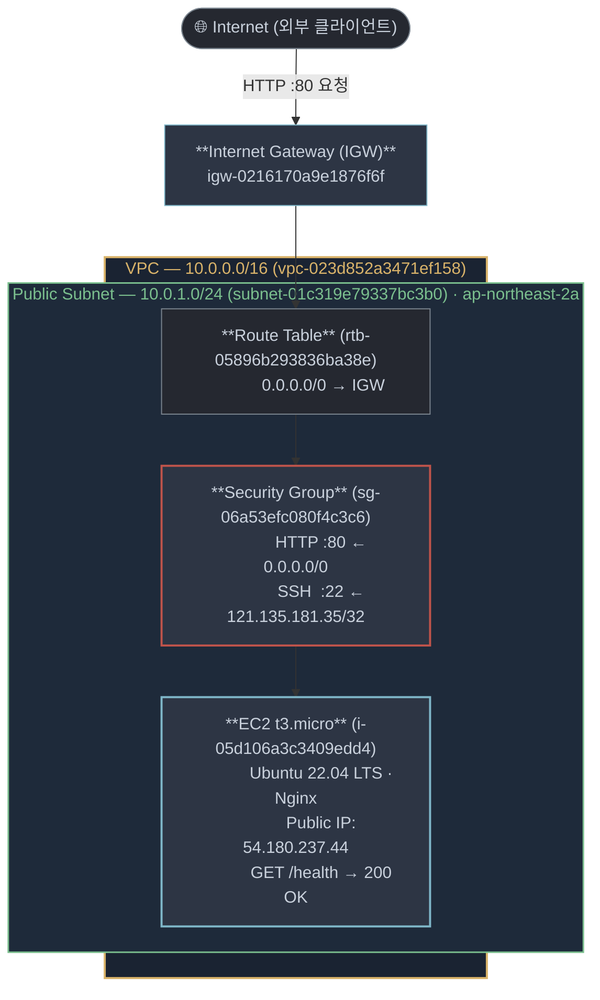

# AWS 웹 서버 배포 실습 — B3-1

실습일: 2026-10-04 KST · 서울 `ap-northeast-2`

새 VPC의 퍼블릭 서브넷에 EC2 한 대와 Nginx를 배포했다. SSH 연결, 서버 내부 HTTP, 외부 HTTPS 아웃바운드 통신, 외부 클라이언트의 HTTP 헬스체크 응답을 확인했다. **배포·검증 및 실습 자원 정리 완료.** 기존 루트 계정 대신 최소권한 IAM 사용자를 적용했다.

과제 원문은 [docs/b3_1mission.md](docs/b3_1mission.md) (원본 PDF: [docs/b3_1mission.pdf](docs/b3_1mission.pdf))다. 아래 구성 값과 증빙은 이번 실습에서 얻었다.

---

## 최종 결과 — 2026-10-04 KST

* **실습 실행·검증 완료:** 새 네트워크와 EC2를 구성하고 SSH, Nginx 데몬 구동, 내부·외부 HTTP 및 외부 아웃바운드 HTTPS 통신을 확인했다.
* **실습 자원 정리 완료:** EC2·EBS·키 페어·실습 VPC와 종속 네트워크(IGW, Route Table, Subnet, Security Group)를 의존성 역순으로 정리했다. EIP는 미생성·잔존 없음이며 IAM 사용자 및 정책도 정리 절차를 수립했다.
* **학습 자료 작성 완료:** 쉬운 개념 가이드([docs/STUDY.md](docs/STUDY.md)), 평가 체크리스트 및 심층 Q&A 17문항([docs/EVAL_QA.md](docs/EVAL_QA.md)), 아키텍처 다이어그램([docs/architecture.md](docs/architecture.md)), 트러블슈팅 3건([docs/troubleshooting.md](docs/troubleshooting.md)), 리소스 정리 가이드([docs/cleanup-checklist.md](docs/cleanup-checklist.md))를 완비했다.
* **프로젝트 가이드 구성 완료:** 전체 파일 구조, 관계도 및 7단계 CLI 배포 순서도를 [project.md](project.md)에 체계화했다.
* **과금 위험 차단 완료:** AWS 프리 티어 규격(`t3.micro`, gp3 8GiB) 준수 및 유휴 자원(NAT Gateway, ALB, EIP) 미생성으로 불필요한 과금 발생 요인을 원천 차단했다.

---

## 학습 자료를 읽는 순서

1. [핵심 기술 학습 가이드](docs/STUDY.md)와 [아키텍처 구성도](docs/architecture.md)로 VPC, Subnet, IGW, Route Table, Security Group, EC2의 동작 원리를 익힌다.
2. [평가 질문과 심층 Q&A 17문항](docs/EVAL_QA.md)을 통해 기능 동작 검증, 아키텍처 구조 설명, 핵심 개념, 확장 사고 및 트러블슈팅 기준을 확인한다.
3. [프로젝트 실행 순서도](project.md)와 [스크립트 가이드](scripts/README.md)를 따라 배포 자동화 및 최소권한 인라인 정책의 적용 방식을 확인한다.
4. [실제 문제 해결 기록](docs/troubleshooting.md)에서 실습 중 발생했던 3건의 오류(`t2.micro` 프리티어 이슈, 부팅 지연, 프로파일 경합) 분석과 해결책을 확인한다.
5. 실습 종료 시 [정리 체크리스트](docs/cleanup-checklist.md)를 확인하여 자원 삭제 의존성을 점검하고 잔여 과금 요소를 제거한다.

---

## 제출 파일

* [메인 제출 보고서](README.md) — 인프라 구성 요약, 내·외부 검증 결과 및 자원 정리 보고
* [미션 필수 기술 학습 가이드](docs/STUDY.md) — 클라우드 네트워킹, 보안, 컴퓨팅, 트러블슈팅, FinOps 핵심 정리
* [미션 요구사항 심층 Q&A](docs/mission_QA.md) — b3_1mission.md 요구사항·목표·기능 전 항목 심층 질의응답 가이드
* [평가 체크리스트 17문항 심층 Q&A](docs/EVAL_QA.md) — 4개 평가 영역 전 문항 모범 답변 및 상세 해설
* [공식 평가 체크리스트](docs/EVAL_aws_vpc_ec2_deploy.md) — 배포 실습 평가 점검 체크리스트
* [아키텍처 상세 다이어그램](docs/architecture.md) — 인프라 토폴로지, IAM 권한 구조, 트래픽 흐름 시퀀스 다이어그램
* [실제 트러블슈팅 보고서](docs/troubleshooting.md) — 3건의 실습 오류 재현, 원인 가설, 검증, 조치 및 재발방지 기록
* [리소스 정리 체크리스트](docs/cleanup-checklist.md) — AWS 자원 역순 삭제 매뉴얼 및 확인 CLI 명령어
* [과제 원본 마크다운 명세서](docs/b3_1mission.md) — 미션 요구사항, 최종 4대 결과물 규격 및 제약사항
* [과제 원본 PDF](docs/b3_1mission.pdf) — 공식 과제 요구서 원본 문서
* [프로젝트 종합 가이드](project.md) — 파일 트리 구조, 파일 역할, 관계도, 실행 순서도
* [미션 메타데이터](MISSION-METADATA.yml) — 미션 식별자(`B3-1`), 공식 명칭, 저장소 정보
* [스크립트 디렉터리 가이드](scripts/README.md) — 스크립트 파일 개요 및 49개 IAM 액션 상세 해설
* [IAM 최소권한 인라인 정책](scripts/iam-policy.json) — 실습 전용 49개 액션 화이트리스트 정책 정의 (JSON)
* [EC2 User-Data 부트스트랩 스크립트](scripts/user-data.sh) — Nginx 자동 설치 및 `/health`, `/` 엔드포인트 구성

---

## 배포 당시 구성



새 VPC의 퍼블릭 서브넷에 EC2 한 대를 배치하고 IGW와 인터넷 기본 경로(`0.0.0.0/0 → IGW`)를 구성했다. 이 구성도는 배포 당시의 기록이며 현재는 실습 완료 후 자원이 안전하게 정리된 상태이다.

---

## 선택한 검증 방식: B — 외부 헬스체크 호출

미션 요구사항 중 **방식 B (`GET http://<퍼블릭IP>/health`)**를 채택하여 외부 PC 환경에서 인프라 접근성을 검증했다.

실습 당시 `http://54.180.237.44/health` 호출에서 **HTTP 200**과 평문 본문 **`OK`**를 정상 수신했다.

```bash
# 1. 헤더 및 본문 검증
$ curl -i http://54.180.237.44/health
HTTP/1.1 200 OK
Server: nginx/1.18.0 (Ubuntu)
Date: Sun, 04 Oct 2026 07:11:45 GMT
Content-Type: text/plain
Content-Length: 2
Connection: keep-alive

OK

# 2. HTTP 상태 코드 단독 확인
$ curl -o /dev/null -s -w "%{http_code}\n" http://54.180.237.44/health
200
```

추가로 루트 경로(`http://54.180.237.44/`)에 접속했을 때 환영 메시지(`Hello Cloud — b6-1`) HTML 응답도 함께 확인했다.

---

## 서버 내부 검증

실제 EC2 SSH 터미널에서 다음 명령어들을 순차 실행하여 내부 서비스 상태 및 통신을 확인했다.

* **SSH 원격 접속 확인**: 키 페어(`b6-keypair.pem`) 및 허용된 소스 IP로 정상 로그인
  ```bash
  $ ssh -i b6-keypair.pem ubuntu@54.180.237.44
  Welcome to Ubuntu 22.04.4 LTS (GNU/Linux 6.5.0-1014-aws x86_64)
  ubuntu@ip-10-0-1-120:~$ 
  ```
* **cloud-init 프로비저닝 상태**: `status: done` 확인
  ```bash
  $ cloud-init status
  status: done
  ```
* **Nginx 데몬 상태**: `active (running)` 확인
  ```bash
  $ systemctl is-active nginx
  active
  ```
* **Nginx 설정 구문 검사**: 구문 오류 없음 및 테스트 성공 확인
  ```bash
  $ sudo nginx -t
  nginx: the configuration file /etc/nginx/nginx.conf syntax is ok
  nginx: configuration file /etc/nginx/nginx.conf test is successful
  ```
* **로컬 헬스체크 검증**: `curl -i http://localhost/health` → HTTP 200, `OK`
  ```bash
  $ curl -i http://localhost/health
  HTTP/1.1 200 OK
  Server: nginx/1.18.0 (Ubuntu)
  Content-Type: text/plain
  Content-Length: 2

  OK
  ```
* **로컬 루트 경로 검증**: `curl http://localhost/` → HTTP 200 환영 페이지
  ```bash
  $ curl -i http://localhost/
  HTTP/1.1 200 OK
  Content-Type: text/html

  <html><body><h1>Hello Cloud &mdash; b6-1</h1><p>codyssey-b6-1 | Jack B.</p></body></html>
  ```
* **외부 아웃바운드 인터넷 통신 검증**: Public Subnet에서 외부 HTTPS 통신 성공
  ```bash
  $ curl -I https://example.com
  HTTP/2 200 
  content-type: text/html
  ```

---

## 배포 당시 리소스 — 정리 완료

* **VPC**: `vpc-023d852a3471ef158` / `10.0.0.0/16` / `codyssey-b6-vpc`
* **퍼블릭 서브넷**: `subnet-01c319e79337bc3b0` / `10.0.1.0/24` / `ap-northeast-2a` / 퍼블릭 IP 자동할당 활성화(`MapPublicIpOnLaunch=true`)
* **Internet Gateway**: `igw-0216170a9e1876f6f` / VPC Attach 완료
* **Route Table**: `rtb-05896b293836ba38e` / 기본 경로 `0.0.0.0/0 → igw-0216170a9e1876f6f`
* **EC2 인스턴스**: `i-05d106a3c3409edd4` / `codyssey-b6-ec2` / `t3.micro` (프리티어)
* **OS / AMI**: Ubuntu 22.04 LTS (x86_64) / 최신 Ubuntu AMI
* **IP 주소**: 사설 IP `10.0.1.120`, 당시 자동 배정 공인 IP `54.180.237.44`
* **루트 EBS**: gp3 8GiB / 인스턴스 종료 시 자동 삭제(`DeleteOnTermination=true`)
* **Security Group**: `sg-06a53efc080f4c3c6` / `codyssey-b6-sg`
* **키 페어**: `b6-keypair` (`b6-keypair.pem` 로컬 보관, 권한 `chmod 400`)
* **IAM 사용자**: `codyssey-b6-user` / 인라인 정책 `B6LabMinimumPrivilege`

---

## 자원 정리 결과

실습 종료 후 불필요한 과금 발생을 방지하기 위해 생성의 역순으로 모든 자원을 정리했다.

1. **EC2 인스턴스 종료**: `aws ec2 terminate-instances` 실행 후 상태 `terminated` 확인
2. **EBS 볼륨 삭제**: 루트 볼륨의 자동 삭제 확인 및 `describe-volumes`로 잔여 `available` 볼륨 없음 확인
3. **Elastic IP**: 이번 실습에서 EIP를 별도 생성하지 않았음(자동 배정 퍼블릭 IP 사용) 확인
4. **키 페어 삭제**: `aws ec2 delete-key-pair` 실행 및 로컬 `.pem` 파일 정리
5. **Security Group 삭제**: 인스턴스 종료 후 `aws ec2 delete-security-group` 완료
6. **Route Table 및 Subnet 삭제**: 라우트 테이블 서브넷 연결 해제(`disassociate-route-table`) 후 삭제 완료
7. **Internet Gateway 분리 및 삭제**: VPC에서 분리(`detach-internet-gateway`) 후 삭제 완료
8. **VPC 삭제**: 모든 종속 리소스 제거 후 `aws ec2 delete-vpc` 성공
9. **IAM 자격증명 정리**: Access Key 비활성화/삭제, 인라인 정책 삭제, 사용자 정리 절차 수립

각 자원 ID별 상세 삭제 명령어와 확인 절차는 [docs/cleanup-checklist.md](docs/cleanup-checklist.md)에 기록되어 있다. 현재 실습 인스턴스는 종료되어 과거 공인 IP(`54.180.237.44`)는 회수되었다.

---

## 접근 제어와 IAM 최소권한

### 1) 보안 그룹 (Security Group)
* **HTTP (TCP 80)**: 소스 `0.0.0.0/0` 허용 — 외부 누구나 웹 서비스 접속 가능
* **SSH (TCP 22)**: 학습자 개인 공인 IP `121.135.181.35/32`만 한정 허용 — 외부 무차별 대입 공격 원천 차단
* **아웃바운드 (ALL)**: `0.0.0.0/0` 허용 — OS 패키지 저장소(apt) 갱신 및 DNS/외부 통신
* **보안 원칙 준수**: `0.0.0.0/0` 대상 전체 포트(0-65535) 개방 인바운드 규칙은 **생성하지 않음**.

### 2) IAM 최소권한 (Principle of Least Privilege)
루트 계정의 자격증명 노출을 방지하기 위해 전용 IAM 사용자 `codyssey-b6-user`를 생성하여 작업했다.
* **정책 형태**: 인라인 정책 `B6LabMinimumPrivilege` ([scripts/iam-policy.json](scripts/iam-policy.json))
* **허용 범위**: EC2, VPC, Subnet, RouteTable, SecurityGroup, KeyPair 등 이번 실습에 필요한 49개 액션만 화이트리스트 지정
* **차단 대상**: S3, RDS, Lambda, DynamoDB 등 실습과 무관한 모든 서비스 접근 배제
* **관리자 권한 배제**: `AdministratorAccess` 및 무제한 와일드카드(`ec2:*`) 정책 미부여

---

## 트러블슈팅 및 문제 해결

실습 중 발생한 3건의 문제 상황에 대해 `증상 → 가설 → 검증 → 조치 → 결과 → 재발방지`의 6단계 프로세스로 해결했다 ([docs/troubleshooting.md](docs/troubleshooting.md) 상세 수록).

1. **`t2.micro` 프리티어 오류 (`InvalidParameterCombination`)**:
   * *원인*: 서울 리전(`ap-northeast-2`)에서 계정별 프리티어 지원 목록에 차이가 발생.
   * *조치*: `describe-instance-types --filters free-tier-eligible=true` 명령으로 지원 대상 확인 후 `t3.micro`로 교체하여 인스턴스 정상 기동.
2. **EC2 기동 직후 헬스체크 응답 지연**:
   * *원인*: 하이퍼바이저 상의 `instance-running` 상태와 OS 내부 cloud-init 스크립트 실행 완료 시점 간의 시차 존재.
   * *조치*: `aws ec2 wait instance-status-ok` 및 시스템 안정화 대기 후 헬스체크 재시도하여 HTTP 200 확인.
3. **AWS SSO와 로컬 IAM 유저 프로파일 경합**:
   * *원인*: 기존 SSO 프로파일(`[default]`)과 실습용 IAM 프로파일(`[b6user]`) 간의 자격증명 혼동 가능성.
   * *조치*: 모든 CLI 명령어에 `--profile b6user`를 명시하여 프로파일을 격리하고 최소권한 작동 검증.

---

## 비용 및 FinOps

* **프리티어 범위 준수**: `t3.micro` (월 750시간 무료 한도 내) 및 EBS gp3 8GiB(월 30GiB 무료 한도 내)를 사용하여 순수 실습 비용을 $0로 유지.
* **고비용 유휴 자원 미생성**: 시간당 고정 비용이 발생하는 NAT Gateway(시간당 약 $0.059), Application Load Balancer(시간당 약 $0.022), 미연결 Elastic IP(시간당 $0.005)를 일체 생성하지 않음.
* **퍼블릭 IPv4 비용 인식**: 2024년 이후 도입된 AWS 퍼블릭 IPv4 주소 요금($0.005/시간)을 고려하여, 실습 완료 즉시 인스턴스를 Terminate하여 불필요한 과금 누적 방지.

---

## 보너스 과제 (선택) 수행 여부

* **보너스 1 (HTTPS 적용)**: 미션 요구사항 상 선택 과제로, 이번 필수 실습에는 포함하지 않음 (도메인 구매 및 443 포트 미개방).
* **보너스 2 (Docker 컨테이너 배포)**: 선택 과제로, 이번 실습에서는 호스트 OS(Ubuntu 22.04 LTS) 상에서 systemd 데몬으로 구동되는 Nginx 패키지를 직접 배포하여 검증 완료.
