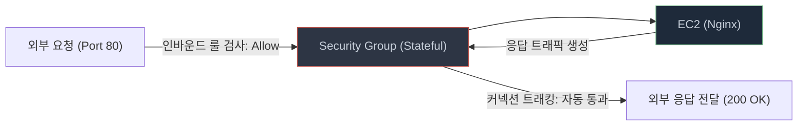
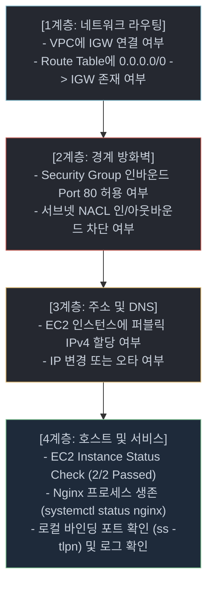

# AWS VPC 기반 웹 서비스 인프라 구축 기술 가이드 (`STUDY.md`)

본 문서는 **B3-1 (AWS 웹 서비스 인프라 구축)** 미션을 성공적으로 수행하고 평가 질문에 완벽히 대응하기 위해 필수적인 클라우드 네트워킹, 보안, 컴퓨팅, 운영 및 비용 관리의 핵심 기술 개념을 종합 정리한 학습 자료입니다.

---

## 목차
1. [개요 및 핵심 목표](#1-개요-및-핵심-목표)
2. [클라우드 가상 네트워킹 (VPC & Routing)](#2-클라우드-가상-네트워킹-vpc--routing)
3. [보안 및 접근 제어 (Security Group, NACL, IAM)](#3-보안-및-접근-제어-security-group-nacl-iam)
4. [컴퓨팅 및 웹 서버 배포 (EC2, EBS, User Data, Nginx)](#4-컴퓨팅-및-웹-서버-배포-ec2-ebs-user-data-nginx)
5. [엔지니어링 트러블슈팅 및 운영 진단 방법론](#5-엔지니어링-트러블슈팅-및-운영-진단-방법론)
6. [클라우드 재무 관리 및 리소스 정리 (FinOps)](#6-클라우드-재무-관리-및-리소스-정리-finops)
7. [AWS CLI 핵심 명령어 레퍼런스](#7-aws-cli-핵심-명령어-레퍼런스)
8. [관련 프로젝트 문서 링크](#8-관련-프로젝트-문서-링크)

---

## 1. 개요 및 핵심 목표

클라우드는 단순한 "원격의 빠른 가상 컴퓨터"가 아닙니다. **격리된 가상 사설망(VPC)**, **다계층 방화벽(Security Group/NACL)**, 그리고 **세분화된 제어 평면 권한(IAM)**이 유기적으로 결합된 복합 인프라 환경입니다.

### 본 미션의 4대 핵심 역량
1. **격리된 네트워크 설계**: CIDR 블록 할당, 서브넷 분할, 인터넷 게이트웨이 및 라우팅 테이블 연결.
2. **최소 권한 원칙(Least Privilege) 구현**: 필요 포트만 개방하는 보안 그룹 규칙과 전용 IAM 정책 수립.
3. **무인 배포 자동화**: User Data 스크립트를 통한 OS 부팅 시점 Nginx 설치 및 헬스체크 구성.
4. **체계적 문제 해결 및 비용 통제**: 가설-검증 기반 트러블슈팅과 의존성 역순 리소스 정리.

---

## 2. 클라우드 가상 네트워킹 (VPC & Routing)

### 2.1 VPC (Virtual Private Cloud)
- **정의**: AWS 계정 전용의 논리적으로 격리된 가상 사설 네트워크 공간입니다.
- **사설 IP 대역 (RFC 1918)**:
  - `10.0.0.0/8` (10.0.0.0 ~ 10.255.255.255) — 대규모 엔터프라이즈 환경 권장 (본 프로젝트 사용: `10.0.0.0/16`)
  - `172.16.0.0/12` (172.16.0.0 ~ 172.31.255.255)
  - `192.168.0.0/16` (192.168.0.0 ~ 192.168.255.255) — 가정/소규모 오피스
- **CIDR (Classless Inter-Domain Routing) 표기법**:
  - `10.0.0.0/16`: 앞 16비트가 네트워크 ID, 뒤 16비트(65,536개)가 호스트 IP 주소 공간.
  - `10.0.1.0/24`: 앞 24비트가 네트워크 ID, 뒤 8비트(256개)가 호스트 IP 주소 공간.

> [!IMPORTANT]
> **AWS 서브넷 예약 IP (Subnet Reserved IPs)**  
> 각 서브넷 CIDR 블록에서 처음 4개와 마지막 1개(총 5개)의 IP는 AWS에서 내부 관리용으로 자동 예약하므로 인스턴스에 할당할 수 없습니다.  
> 예: `10.0.1.0/24` 서브넷의 경우:
> - `10.0.1.0`: 네트워크 주소
> - `10.0.1.1`: VPC 라우터 주소
> - `10.0.1.2`: DNS 서버 주소 (AmazonProvidedDNS)
> - `10.0.1.3`: AWS 향후 사용을 위한 예약 주소
> - `10.0.1.255`: 네트워크 브로드캐스트 주소 (VPC는 브로드캐스트 미지원이나 예약됨)  
> *사용 가능 주소 = $256 - 5 = 251$개*

---

### 2.2 서브넷 (Subnet)
- **개념**: VPC의 IP 주소 범위를 특정 가용 영역(AZ)에 할당하여 잘라낸 네트워크 세그먼트입니다.
- **Public Subnet vs Private Subnet**:
  - **Public Subnet**: 라우팅 테이블에 **인터넷 게이트웨이(IGW)로 향하는 기본 경로(`0.0.0.0/0 → IGW`)**가 존재하며, 인스턴스가 공인 IP를 가질 수 있는 서브넷.
  - **Private Subnet**: 인터넷 게이트웨이로 향하는 직접 경로가 없어 외부 인터넷에서 직접 접근이 불가능한 서브넷 (데이터베이스, 백엔드 서버 배치).
- **`MapPublicIpOnLaunch`**: 서브넷 내에서 인스턴스 기동 시 퍼블릭 IPv4 주소를 자동으로 동적 할당할지 여부를 결정하는 속성.

---

### 2.3 인터넷 게이트웨이 (Internet Gateway, IGW)
- **역할**: VPC 내부 인스턴스와 공인 인터넷 간의 통신을 중계하는 수평 확장형 고가용성 관리형 게이트웨이.
- **1:1 NAT (Network Address Translation)**:
  - 인스턴스는 자신의 가상 NIC(ENI)에 프라이빗 IP(`10.0.1.x`)만 인식합니다.
  - 인스턴스가 외부로 나갈 때, IGW가 해당 패킷의 출발지 IP를 매핑된 공인 IP(`54.180.237.44`)로 실시간 변환하고, 외부에서 공인 IP로 들어오는 트래픽을 프라이빗 IP로 역변환합니다.

---

### 2.4 라우팅 테이블 (Route Table)
- **패킷 포워딩 원리**: 서브넷 내부에서 발생한 네트워크 트래픽이 목적지 IP에 따라 어디로 전달되어야 하는지 결정하는 규칙 세트.
- **Longest Prefix Match (최장 일치 우선 원칙)**:
  - 라우팅 테이블에 목적지와 일치하는 경로가 여러 개 있을 때, 가장 구체적인(서브넷 마스크 비트 수가 큰) 규칙이 우선 적용됩니다.

```text
[라우팅 테이블 예시]
목적지 (Destination)        타깃 (Target)             우선순위 / 의미
─────────────────────────────────────────────────────────────────────────────
10.0.0.0/16                local                    1순위 (VPC 내부 사설 통신)
0.0.0.0/0                  igw-0216170a9e1876f6f    2순위 (그 외 모든 인터넷 트래픽)
```

---

## 3. 보안 및 접근 제어 (Security Group, NACL, IAM)

### 3.1 보안 그룹 (Security Group)
- **적용 단위**: 인스턴스의 가상 네트워크 인터페이스(ENI) 단위로 적용되는 가상 방화벽.
- **상태 저장 (Stateful)**:
  - 인바운드 규칙으로 허용된 요청에 대한 응답 트래픽은 **아웃바운드 규칙과 상관없이 자동으로 허용**됩니다.
  - 반대로 인스턴스에서 시작된 아웃바운드 연결에 대한 수신 응답도 인바운드 규칙과 무관하게 자동 허용됩니다.
- **화이트리스트 기반 (Default Deny)**:
  - 기본적으로 모든 인바운드는 차단되며, 명시적으로 추가된 "허용(Allow)" 규칙만 동작합니다 (명시적 거부 규칙 생성 불가).



---

### 3.2 네트워크 ACL (Network ACL, NACL)
- **적용 단위**: 서브넷 경계에서 동작하는 서브넷 수준의 방화벽.
- **비상태 저장 (Stateless)**:
  - 들어오는 트래픽과 나가는 트래픽을 완전히 별개로 평가합니다.
  - 즉, 인바운드 80 포트를 허용했더라도, 그에 대한 응답을 클라이언트에게 돌려주려면 아웃바운드 규칙에서 **임시 포트(Ephemeral Ports: 1024~65535)**를 명시적으로 열어두어야 통신이 성립합니다.
- **규칙 평가 방식**:
  - 규칙 번호(Rule Number, 1~32766)가 낮은 순서대로 우선 평가되며, 최초로 매칭되는 규칙에서 평가가 종료됩니다.

---

### 3.3 Security Group vs Network ACL 비교표

| 비교 항목 | 보안 그룹 (Security Group) | 네트워크 ACL (Network ACL) |
|---|---|---|
| **동작 계층** | 인스턴스 / ENI 수준 | 서브넷(Subnet) 수준 |
| **상태 유지** | **Stateful (상태 저장)** | **Stateless (비상태 저장)** |
| **규칙 유형** | **허용(Allow) 규칙만** 지원 | **허용(Allow) 및 거부(Deny)** 지원 |
| **규칙 평가** | 모든 규칙을 종합 평가하여 허용 여부 결정 | **규칙 번호 순서대로** 순차 평가 |
| **기본 동작** | 기본 모든 인바운드 차단 (Default Deny) | 기본 모든 트래픽 허용 (기본 NACL 기준) |
| **반환 트래픽** | 커넥션 추적으로 자동 허용 | 아웃바운드에 임시 포트 명시 필요 |

---

### 3.4 AWS IAM (Identity and Access Management)
- **책임 영역**: **제어 평면 (Control Plane)** — AWS API 호출 자격 증명 및 권한 인가.
- **최소 권한의 원칙 (Principle of Least Privilege)**:
  - 사용자나 시스템에 업무 수행에 꼭 필요한 최소한의 권한만 부여하고 그 외 모든 접근을 묵시적 거부(Implicit Deny) 상태로 두는 보안 원칙.
- **IAM 정책 구조 (JSON)**:
  - `Version`: 정책 문법 버전 (`2012-10-17`).
  - `Statement`: 단일 또는 다중 권한 선언문.
    - `Effect`: `Allow` 또는 `Deny`.
    - `Action`: 허용할 구체적 API 목록 (예: `ec2:RunInstances`, `ec2:DescribeRouteTables`).
    - `Resource`: 해당 조치가 적용될 대상 자원 ARN (`*` 또는 특정 VPC/인스턴스 ARN).

---

## 4. 컴퓨팅 및 웹 서버 배포 (EC2, EBS, User Data, Nginx)

### 4.1 EC2 (Elastic Compute Cloud) 인스턴스
- **인스턴스 타입 명명 규칙 (예: `t3.micro`)**:
  - `t`: 인스턴스 패밀리 (T 패밀리는 가변적 부하에 적합한 버스트형(Burstable) 범용 타입).
  - `3`: 하드웨어 세대 (3세대).
  - `micro`: 인스턴스 크기 (2 vCPU, 1 GiB Memory).
- **CPU 크레딧 메커니즘**:
  - T 계열 인스턴스는 기준 성능(Baseline) 이하일 때 크레딧을 축적하고, 트래픽 폭증 시 크레딧을 소비하여 100% vCPU 성능으로 버스트 동작합니다.
- **리전별 프리티어 유의점**:
  - 과거 실습 템플릿의 `t2.micro`는 신규 AWS 계정 및 서울 리전에서 프리티어 대상에서 제외되고 `t3.micro`가 적용되는 경우가 많으므로 `describe-instance-types --filters free-tier-eligible=true` 조회가 필수적입니다.

---

### 4.2 EBS (Elastic Block Store)
- **개념**: EC2 인스턴스에 마운트하여 사용하는 네트워크 기반 고성능 블록 스토리지.
- **볼륨 타입**:
  - `gp3` (최신 범용 SSD): 기본 용량과 무관하게 3,000 IOPS 및 125 MB/s 처리량을 기본 제공하며 비용 효율적.
  - `gp2` (이전 세대): 용량에 비례하여 IOPS가 결정됨 (1GB당 3 IOPS).
- **`DeleteOnTermination` 플래그**:
  - EC2 인스턴스가 Terminate될 때 루트 EBS 볼륨을 함께 삭제할지 여부 (`true` 권장).
  - 이 값이 `false`로 설정되면 인스턴스 삭제 후에도 유휴 볼륨이 계정에 남아 지속 과금의 원인이 됩니다.

---

### 4.3 SSH 키페어 (Key Pair)
- **비대칭 암호화 원리**:
  - **공개키 (Public Key)**: 인스턴스 생성 시 AWS가 게스트 OS의 `/home/ubuntu/.ssh/authorized_keys` 파일에 자동 주입.
  - **개인키 (Private Key, `.pem`)**: 사용자가 로컬에 다운로드하여 보관하며 절대로 외부에 공개하거나 Git에 커밋해서는 안 됨.
- **권한 설정 필수**:
  - `chmod 400 <keyname>.pem` 명령어로 소유자 외 다른 계정의 읽기/쓰기 권한을 제거해야 OpenSSH 클라이언트에서 접속을 허용합니다 (Permissions 0644 are too open 에러 방지).

---

### 4.4 User Data 및 Cloud-init
- **역할**: EC2 인스턴스가 처음 부팅될 때 쉘 스크립트나 클라우드 설정을 실행하여 애플리케이션 설치 및 환경 구성을 자동화하는 기능.
- **동작 특성**:
  - 기본적으로 인스턴스의 **최초 기동(First Boot) 시 루트(`root`) 권한으로 1회만 실행**됩니다.
  - 표준 출력 및 에러 로그는 게스트 OS 내부의 `/var/log/cloud-init-output.log`에 실시간 기록됩니다.

---

### 4.5 Nginx 웹 서버 및 `/health` 엔드포인트
- **Nginx 아키텍처 특성**:
  - Apache(프로세스/스레드 기반)와 달리 **비동기 이벤트 구동(Event-Driven Non-blocking)** 구조로 설계되어 적은 메모리로 대규모 동시 접속을 효율적으로 처리.
- **헬스체크(Health Check) 구성 원리**:
  - 웹 애플리케이션(FastAPI, Express 등)을 띄우지 않고도 Nginx 라우팅 블록 내에서 `return 200 'OK';` 선언을 통해 커널 수준에서 즉시 가벼운 정적 응답을 회신할 수 있습니다.

```nginx
location /health {
    add_header Content-Type text/plain;
    return 200 'OK';
}
```

---

## 5. 엔지니어링 트러블슈팅 및 운영 진단 방법론

### 5.1 체계적 트러블슈팅 6단계 템플릿
문제가 발생했을 때 추측으로 설정을 임의 변경(Shotgun Debugging)하지 않고 데이터와 논리를 근거로 해결합니다.

```text
[1. 증상 (Symptom)]      구체적인 오류 현상, 반환 코드, CLI 실패 메시지 기술
         │
[2. 가설 (Hypothesis)]   시스템 구성 요소를 바탕으로 발생 가능한 근본 원인 추론
         │
[3. 검증 (Verification)] 로그 확인, 쿼리 명령어, 네트워크 패킷 캡처 등으로 가설 입증
         │
[4. 조치 (Action)]       가장 영향도가 적고 정확한 단일 구성 변경 수행
         │
[5. 결과 (Result)]       재테스트를 통해 기능 정상 복구 및 사이드 이펙트 유무 확인
         │
[6. 재발방지 (Prevention)]체크리스트 등록, 자동화 스크립트 개선, 가드레일 정책 추가
```

---

### 5.2 4계층 Outside-In 네트워크 점검 모델

외부 접속 장애 발생 시 바깥쪽(인터넷 관문)부터 안쪽(서버 프로세스)으로 좁혀 들어가는 표준 진단 모델입니다.



---

## 6. 클라우드 재무 관리 및 리소스 정리 (FinOps)

### 6.1 숨은 과금 유발 요인 Top 4
1. **유휴 Elastic IP (EIP)**:
   - 인스턴스에 연결되어 가동 중일 때는 무료이나, 인스턴스를 삭제하고 EIP만 할당(Allocated)해 두면 시간당 비용(약 $0.005/hr)이 부과됩니다.
2. **미연결(Orphaned) EBS 볼륨**:
   - 인스턴스를 종료해도 `DeleteOnTermination=false`였던 볼륨은 삭제되지 않고 `available` 상태로 남아 기가바이트당 월 과금이 지속됩니다.
3. **NAT Gateway**:
   - 실습 중 실수로 생성한 NAT Gateway는 생성 즉시 시간당 약 $0.059(월 약 $43)와 처리 데이터 비용이 발생합니다.
4. **타 리전 잔여 자원**:
   - 기본 설정된 타 리전(예: `us-east-1`, `us-west-2`)에 생성해둔 테스트 자원이 방치되어 프리티어 한도를 초과하는 경우.

---

### 6.2 자원 역순 삭제 의존성 체계

클라우드 자원은 상호 참조 관계를 가지므로 **생성 순서의 역순**으로 삭제해야 `DependencyViolation` 에러가 발생하지 않습니다.

```text
[1] EC2 인스턴스 Terminate (종료 완료 대기)
     └── [2] 미사용 EBS 볼륨 확인 및 삭제
     └── [3] Security Group 삭제 (EC2가 물고 있으면 삭제 불가)
[4] Subnet 및 Route Table 연계 해제 후 삭제
[5] Internet Gateway를 VPC에서 분리(Detach) 후 삭제
[6] VPC 삭제 (내부 모든 서브넷, 게이트웨이가 제거되어야 삭제 가능)
[7] Key Pair 및 IAM User / Access Key 삭제
```

---

## 7. AWS CLI 핵심 명령어 레퍼런스

모든 실습 명령은 서울 리전 및 전용 프로파일(`--profile b6user --region ap-northeast-2`)을 기준으로 작성되었습니다.

```bash
# 1. VPC 생성 및 DNS 속성 활성화
aws ec2 create-vpc --cidr-block 10.0.0.0/16
aws ec2 modify-vpc-attribute --vpc-id <VPC_ID> --enable-dns-hostnames

# 2. Public Subnet 생성 및 퍼블릭 IP 자동 할당
aws ec2 create-subnet --vpc-id <VPC_ID> --cidr-block 10.0.1.0/24 --availability-zone ap-northeast-2a
aws ec2 modify-subnet-attribute --subnet-id <SUBNET_ID> --map-public-ip-on-launch

# 3. Internet Gateway 생성, VPC 부착, 라우트 추가
aws ec2 create-internet-gateway
aws ec2 attach-internet-gateway --internet-gateway-id <IGW_ID> --vpc-id <VPC_ID>
aws ec2 create-route --route-table-id <RT_ID> --destination-cidr-block 0.0.0.0/0 --gateway-id <IGW_ID>
aws ec2 associate-route-table --route-table-id <RT_ID> --subnet-id <SUBNET_ID>

# 4. 보안 그룹 생성 및 인바운드 포트 허용
aws ec2 create-security-group --group-name b6-sg --description "Web SG" --vpc-id <VPC_ID>
aws ec2 authorize-security-group-ingress --group-id <SG_ID> --protocol tcp --port 80 --cidr 0.0.0.0/0
aws ec2 authorize-security-group-ingress --group-id <SG_ID> --protocol tcp --port 22 --cidr <MY_IP>/32

# 5. EC2 인스턴스 실행 (User Data 주입)
aws ec2 run-instances \
  --image-id resolve:ssm:/aws/service/canonical/ubuntu/server/22.04/stable/current/amd64/hvm/ebs-gp3/ami-id \
  --instance-type t3.micro \
  --key-name b6-keypair \
  --security-group-ids <SG_ID> \
  --subnet-id <SUBNET_ID> \
  --user-data file://scripts/user-data.sh

# 6. 인스턴스 헬스체크 및 2/2 상태 검사 대기
aws ec2 wait instance-status-ok --instance-ids <INSTANCE_ID>
curl -i http://<PUBLIC_IP>/health
```

---

## 8. 관련 프로젝트 문서 링크

- [README.md](file:///Users/mpeg46551/b3_1/README.md) — 프로젝트 메인 보고서 및 외부 접속 검증 증빙
- [project.md](file:///Users/mpeg46551/b3_1/project.md) — 프로젝트 종합 가이드 (파일 구조, 역할, 순서도)
- [docs/b3_1mission.md](file:///Users/mpeg46551/b3_1/docs/b3_1mission.md) — 원본 미션 요구사항 및 평가 기준 명세서
- [docs/architecture.md](file:///Users/mpeg46551/b3_1/docs/architecture.md) — 아키텍처 다이어그램 및 IAM/트래픽 시퀀스
- [docs/troubleshooting.md](file:///Users/mpeg46551/b3_1/docs/troubleshooting.md) — 실제 발생 3건의 에러 트러블슈팅 분석 보고서
- [docs/cleanup-checklist.md](file:///Users/mpeg46551/b3_1/docs/cleanup-checklist.md) — 과금 방지 리소스 역순 정리 체크리스트
- [docs/EVAL_QA.md](file:///Users/mpeg46551/b3_1/docs/EVAL_QA.md) — 체크리스트 17문항 심층 평가 Q&A 가이드
