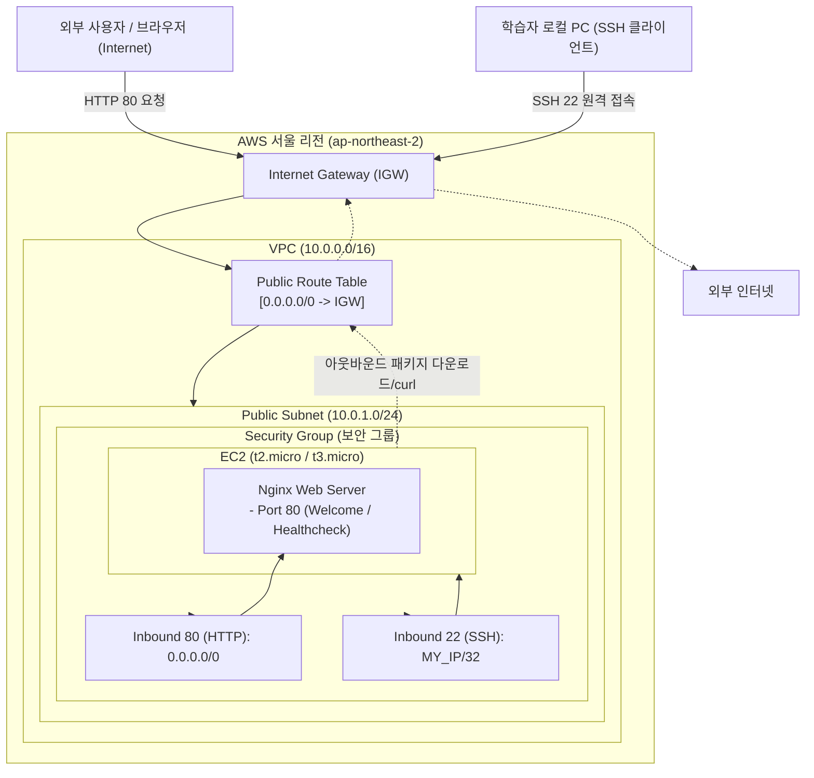

# B3-1 내가 만든 웹사이트를 인터넷에 올려 누구나 쓰게 하기 구현 계획 (Plan)

> **기준 문서:** [`docs/b6-1-mission.md`](file:///Users/mpeg46551/b3_1/docs/b6-1-mission.md)  
> **평가 기준:** [`docs/b6-1-evaluation.md`](file:///Users/mpeg46551/b3_1/docs/b6-1-evaluation.md)  
> **작업 규칙:** [`docs/WORKING-RULES.md`](file:///Users/mpeg46551/b3_1/docs/WORKING-RULES.md)  
> **대상 리전:** AWS 서울 리전 (`ap-northeast-2`)  
> **공식 학습 시간 / 초압축 목표:** 40시간 / 8시간  

---

## 1. 개요 및 목표

### 1.1 미션 목적
클라우드 인프라의 핵심 3요소(네트워크, 컴퓨팅, 보안/권한)를 직접 조합하여, 외부 인터넷 사용자가 안정적으로 접속할 수 있는 Nginx 웹 서비스 환경을 구축합니다.
VPC 기반 격리 네트워크와 최소 권한 원칙(IAM & Security Group)을 적용하고, 장애 발생 시 원인 분석(가설-검증)을 거쳐 해결하며, 실습 종료 후 과금 방지 정리까지 완료하는 실무 인프라 운영 사이클을 완성합니다.

### 1.2 핵심 달성 목표
1. **네트워크 격리 및 라우팅:** VPC, Public Subnet, Internet Gateway(IGW), Route Table(`0.0.0.0/0 → IGW`) 트래픽 흐름 구현 및 설명 가능.
2. **최소 권한 보안 체계:** Security Group(L4 포트/IP 제어)과 IAM(API/리소스 권한 제어)의 책임 분리 및 최소 권한 적용.
3. **컴퓨트 및 서비스 배포:** 서울 리전 EC2(Ubuntu/Amazon Linux) 프로비저닝, SSH 원격 접속, Nginx 웹 서버 구성 및 엔드포인트 응답 검증.
4. **외부 접속 검증:** 외부 인터넷에서 퍼블릭 IP를 통해 서비스 정상 응답(방식 A: 웹 페이지 또는 방식 B: `/health` 200 OK) 확인.
5. **체계적 트러블슈팅:** 증상 → 가설 → 검증 → 조치 → 결과 → 재발방지 6단계 보고서 작성.
6. **과금 0원 원칙(FinOps):** 실습 종료 후 5대 필수 리소스(EC2, EBS, EIP, IGW, VPC) 완전 정리 및 빌링 대시보드 검증.

---

## 2. 최종 필수 산출물 (Deliverables)

| 번호 | 산출물 | 규격 및 위치 | 세부 요건 |
|:---:|:---|:---|:---|
| **1** | **아키텍처 다이어그램** | `docs/architecture.png` 또는 `.pdf` (1장) | VPC, Subnet, IGW, EC2, SG 구성 요소와 외부 → 서비스 인바운드/아웃바운드 트래픽 흐름 명시 |
| **2** | **외부 접속 증빙** | `README.md` 기재 + 스크린샷 1장 이상 | 방식 A(브라우저 `http://<IP>`) 또는 방식 B(`GET http://<IP>/health`) 명시, 실제 접속 IP/URL 및 정상 응답 증빙 |
| **3** | **트러블슈팅 보고서** | `docs/troubleshooting.md` 또는 `.pdf` (1건 이상) | 문제 증상 → 원인 가설 → 검증 방법 → 조치 내용 → 결과 → 재발 방지 포함 |
| **4** | **리소스 정리 체크리스트** | `docs/cleanup-checklist.md` (+ Billing 스크린샷 선택) | EC2, EBS, EIP, IGW, VPC 최소 5종 삭제 확인 및 과금 잔존 리소스 없음 증빙 |

---

## 3. 전체 아키텍처 및 트래픽 흐름



---

## 4. 단계별 구현 계획 (Phase 0 ~ Phase 7)

### Phase 0: 사전 준비 및 IAM 최소 권한 구성 (Preflight & Security)
- [ ] **0.1 루트 계정 배제 및 IAM 사용자 준비**
  - 루트 계정은 일체 실습 작업에 사용하지 않음.
  - 전용 IAM 사용자 생성(예: `cloud-mission-user`) 및 콘솔/CLI 로그인 확인.
- [ ] **0.2 IAM 정책(Policy) 최소 권한 검증**
  - `AdministratorAccess` 절대 부여 금지.
  - 실습 무관 서비스(S3, RDS, DynamoDB 등) 권한 배제.
  - 필수 권한: EC2, VPC, Subnet, Route Table, IGW, Security Group, Key Pair 관련 작업(`AmazonEC2FullAccess` 또는 실습 전용 커스텀 정책).
- [ ] **0.3 리전 및 로컬 환경 확인**
  - 콘솔/CLI 기본 리전: `ap-northeast-2` (서울) 고정.
  - 로컬 공인 IP 확인: `curl -s https://checkip.amazonaws.com` (SSH 22번 소스 제한용).
- [ ] **0.4 EC2 Key Pair 생성 및 권한 설정**
  - 이름: `b3-1-keypair` (ED25519 또는 RSA).
  - 로컬에 `.pem` 파일 다운로드 후 권한 축소: `chmod 400 b3-1-keypair.pem`.

---

### Phase 1: 네트워크 인프라 구축 (VPC & Routing)
- [ ] **1.1 VPC 생성**
  - Name Tag: `b3-1-vpc`
  - IPv4 CIDR Block: `10.0.0.0/16`
  - Tenancy: Default
- [ ] **1.2 Public Subnet 생성**
  - Name Tag: `b3-1-public-subnet-2a`
  - VPC: `b3-1-vpc`
  - 가용 영역(AZ): `ap-northeast-2a`
  - IPv4 CIDR: `10.0.1.0/24`
  - 서브넷 설정: "퍼블릭 IPv4 주소 자동 할당 활성화(Auto-assign Public IPv4)" 체크
- [ ] **1.3 Internet Gateway (IGW) 생성 및 연결**
  - Name Tag: `b3-1-igw`
  - `b3-1-vpc`에 Attach
- [ ] **1.4 Route Table 생성 및 서브넷 라우팅 연결**
  - Name Tag: `b3-1-public-rt`
  - 라우트 규칙 추가: 대상 `0.0.0.0/0` → 타깃 `b3-1-igw`
  - 서브넷 연결(Subnet Association): `b3-1-public-subnet-2a` 연결 확인

---

### Phase 2: 접근 제어 설계 (Security Group)
- [ ] **2.1 Security Group 생성**
  - Name: `b3-1-web-sg`
  - VPC: `b3-1-vpc`
- [ ] **2.2 인바운드(Inbound) 최소 규칙 설정**
  | 유형 | 프로토콜 | 포트 범위 | 소스 (Source) | 설명 |
  |:---:|:---:|:---:|:---:|:---|
  | **HTTP** | TCP | `80` | `0.0.0.0/0` | 웹 서비스 외부 전체 공개 |
  | **SSH** | TCP | `22` | `<내 로컬 공인 IP>/32` | 관리 목적, 특정 IP만 허용 |
- [ ] **2.3 보안 금지 사항 점검**
  - `0.0.0.0/0`에 대해 0-65535 전체 포트 허용 규칙이 절대 없는지 확인.
  - SSH(22)가 `0.0.0.0/0`으로 노출되지 않았는지 엄격 검증.
- [ ] **2.4 아웃바운드(Outbound) 규칙 확인**
  - 기본 All Traffic (`0.0.0.0/0`) 유지 (인스턴스의 패키지 설치 및 외부 curl 통신용).

---

### Phase 3: EC2 인스턴스 프로비저닝 및 Nginx 배포 (Compute & Web)
- [ ] **3.1 EC2 인스턴스 론칭**
  - Name: `b3-1-web-server`
  - AMI: `Ubuntu Server 24.04 LTS` 또는 `Amazon Linux 2023` (프리티어 지원)
  - 인스턴스 유형: `t2.micro` (또는 `t3.micro`)
  - 키 페어: `b3-1-keypair`
  - 네트워크: `b3-1-vpc`, `b3-1-public-subnet-2a`
  - 퍼블릭 IP 자동 할당: 활성화 (Auto-assign Enable)
  - 보안 그룹: `b3-1-web-sg` 선택
  - 스토리지: 8GiB 또는 10GiB gp3 (프리티어 30GiB 한도 준수)
- [ ] **3.2 SSH 접속 및 아웃바운드 인터넷 검증**
  - 로컬 터미널에서 SSH 접속:
    ```bash
    ssh -i ~/.ssh/b3-1-keypair.pem ubuntu@<EC2_PUBLIC_IP>
    ```
  - 인스턴스 내부 아웃바운드 통신 테스트:
    ```bash
    curl -I https://example.com
    ```
- [ ] **3.3 Nginx 설치 및 실행**
  ```bash
  sudo apt-get update -y && sudo apt-get install -y nginx
  sudo systemctl start nginx
  sudo systemctl enable nginx
  sudo systemctl status nginx
  ```
- [ ] **3.4 엔드포인트 및 로컬 검증**
  - 내부 로컬 요청 테스트:
    ```bash
    curl -i http://localhost
    ```
  - (선택지 B: `/health` 설정 시) Nginx 설정에 헬스체크 블록 추가:
    ```nginx
    location /health {
        access_log off;
        return 200 'OK';
        add_header Content-Type text/plain;
    }
    ```
    설정 후 `sudo nginx -t && sudo systemctl reload nginx` 실행 및 `curl -i http://localhost/health` 응답 `200 OK` 확인.

---

### Phase 4: 외부 접속 검증 및 증빙 획득 (Verification & Evidence)
- [ ] **4.1 검증 방식 확정 (택 1)**
  - [ ] **방식 A:** 웹 브라우저에서 `http://<EC2_PUBLIC_IP>` 접속 (Welcome 페이지 또는 커스텀 문구 출력)
  - [ ] **방식 B:** 터미널/브라우저에서 `http://<EC2_PUBLIC_IP>/health` 호출 (HTTP 200 + `OK` 출력)
- [ ] **4.2 외부 클라이언트(로컬 PC)에서 접속 검증**
  ```bash
  # 로컬 PC 터미널에서 실행
  curl -i http://<EC2_PUBLIC_IP>
  # 또는
  curl -i http://<EC2_PUBLIC_IP>/health
  ```
- [ ] **4.3 스크린샷 증빙 캡처**
  - 브라우저 주소창(공인 IP)과 렌더링된 응답 화면 스크린샷 1장 이상 확보.
  - CLI 호출 응답(`200 OK`) 결과 텍스트 확보.
- [ ] **4.4 `README.md` 기재**
  - 선택한 검증 방식(A 또는 B) 명시.
  - 접속 공인 IP 및 URL 기재.
  - 스크린샷 첨부.

---

### Phase 5: 문서 산출물 작성 (Documentation)

- [ ] **5.1 아키텍처 다이어그램 (`docs/architecture.png` 또는 `.pdf`)**
  - VPC(CIDR), Public Subnet(CIDR), IGW, Public Route Table, EC2, Security Group 인바운드 규칙 표기.
  - 외부 트래픽(HTTP 80, SSH 22) 인바운드 흐름 및 아웃바운드 인터넷 흐름 화살표 표기.
  - Draw.io, Mermaid, 또는 Cloud 다이어그램 도구로 제작하여 `docs/architecture.png` 저장.
- [ ] **5.2 트러블슈팅 보고서 (`docs/troubleshooting.md`)**
  - 최소 1건 이상 실제 발생(또는 재현)한 이슈 기록.
  - 필수 6단계 포맷 준수:
    1. **증상(Symptom):** 예: 인스턴스 생성 직후 외부 브라우저에서 무한 로딩 발생
    2. **원인 가설(Hypothesis):** 보안 그룹 80 포트 누락 또는 Route Table 0.0.0.0/0 미연결 가설
    3. **검증 방법(Verification):** `aws ec2 describe-security-groups`, `curl -Iv` 타임아웃 확인, 라우팅 테이블 조회
    4. **조치 내용(Action):** 보안 그룹 인바운드 80번 허용 규칙 추가
    5. **결과(Result):** 외부에서 `curl` 즉시 200 응답 수신 성공
    6. **재발 방지(Prevention):** 인프라 체크리스트에 'Port 80 허용 여부' 프리플라이트 항목 추가
- [ ] **5.3 리소스 정리 체크리스트 (`docs/cleanup-checklist.md`)**
  - 실습 종료 후 삭제할 5대 핵심 리소스 및 삭제 명령어/절차 문서화.

---

### Phase 6: 평가 대비 원리 학습 및 Q&A 정리 (Evaluation Alignment)

`docs/b6-1-evaluation.md`의 4대 평가 항목에 대해 답변 준비:

1. **인프라 구성 및 흐름:**
   - 외부 요청이 IGW → Route Table(`0.0.0.0/0`) → Subnet → Security Group(80 허용) → EC2(Nginx)로 도달하는 과정을 설명.
2. **보안 그룹(SG) vs IAM 차이:**
   - SG: 가상 방화벽으로 네트워크 계층(L4 IP/Port) 패킷 필터링(Stateful).
   - IAM: AWS API 호출 주체의 신원 인증(Authentication) 및 서비스 접근 인가(Authorization).
   - 최소 권한 원칙(Least Privilege)을 적용하여 침해 사고 시 피해 반경(Blast Radius)을 최소화하는 이유 설명.
3. **SSH(22) 소스 제한 이유:**
   - `0.0.0.0/0` 개방 시 전 세계 무차별 대입(Brute-force) 공격 대상이 되므로 관리자 공인 IP(`/32`)로 한정.
4. **장애 발생 시 4단계 점검 순서:**
   - 1) 라우팅(`0.0.0.0/0 → IGW`) → 2) 보안 그룹(인바운드 포트/소스 IP) → 3) 퍼블릭 IP 유효성 → 4) OS 내부 서버 프로세스(`systemctl status nginx`) 및 로그(`error.log`).
5. **확장성 대응 (인스턴스 2대 확장 시):**
   - 단일 EC2의 단일 장애점(SPOF) 극복을 위해 다중 AZ에 서브넷 및 인스턴스 배치, 앞단에 ALB(Application Load Balancer) 배치 및 트래픽 분산, Auto Scaling Group 연계.

---

### Phase 7: 안전한 자원 정리 및 과금 방지 (Teardown & FinOps)

실습 완료 및 증빙 수집 후, 과금 0원을 위해 역순으로 철저히 삭제:

1. **EC2 인스턴스 종료(Terminate):**
   - 상태가 `Terminated`로 전환되는지 확인 (연결된 루트 EBS 볼륨 자동 삭제 여부 확인).
2. **미사용 EBS 볼륨 확인 및 삭제:**
   - EC2 콘솔 → 볼륨(Volumes)에서 `Available` 상태인 잔여 볼륨 완전 삭제.
3. **Elastic IP(탄력적 IP) 릴리스:**
   - 할당된 EIP가 있다면 반드시 `Release` (미사용 시 시간당 과금 발생).
4. **Internet Gateway 분리(Detach) 및 삭제:**
   - VPC에서 분리 후 삭제.
5. **Route Table 및 Subnet, VPC 삭제:**
   - 서브넷 연결 해제 후 VPC 삭제 (`b3-1-vpc` 삭제 시 하위 서브넷 일괄 정리).
6. **Security Group 및 Key Pair 삭제:**
   - 임시 생성된 SG 및 키페어 정리.
7. **AWS Billing Dashboard 확인:**
   - Billing & Cost Management에서 발생 비용 및 프리티어 사용량 점검.
   - `docs/cleanup-checklist.md`에 최종 완료 체크.

---

## 5. 보너스 과제 실행 계획 (선택 사항)

### 보너스 1: 무료 도메인 및 HTTPS(SSL/TLS) 적용
- 무료 도메인 발급(DuckDNS 등) 또는 보유 도메인 활용.
- 도메인 A 레코드를 EC2 퍼블릭 IP로 연결.
- Certbot 설치 및 Let's Encrypt SSL 인증서 발급:
  ```bash
  sudo apt-get install -y certbot python3-certbot-nginx
  sudo certbot --nginx -d <your-domain>
  ```
- 보안 그룹 인바운드에 HTTPS(443) 포트 `0.0.0.0/0` 추가.
- 브라우저에서 `https://<your-domain>` 접속 및 자물쇠 아이콘 증빙.

### 보너스 2: Docker 컨테이너 기반 배포
- EC2 내 Docker Engine 설치:
  ```bash
  sudo apt-get update && sudo apt-get install -y docker.io
  sudo usermod -aG docker $USER
  ```
- 웹 애플리케이션 컨테이너 실행 (호스트 80 ↔ 컨테이너 80 포트 포워딩):
  ```bash
  docker run -d --name my-web -p 80:80 nginx:alpine
  ```
- 검증 및 증빙:
  - `docker ps` 상태(Up) 터미널 스크린샷.
  - 외부 접속 화면 스크린샷.
  - `README.md`에 실행 이미지명, 포트 매핑, 증빙 추가.

---

## 6. 요구사항 추적 매트릭스 (Requirements Traceability Matrix)

| 요구사항 ID | 미션 명세 요구사항 | 구현 단계 | 검증 방법 (Verification) | 증빙 결과물 (Evidence) |
|:---:|:---|:---:|:---|:---|
| **REQ-NET-01** | VPC 1개 생성 | Phase 1 | `aws ec2 describe-vpcs` / 콘솔 확인 | `docs/architecture.png` |
| **REQ-NET-02** | Public Subnet 1개 생성 | Phase 1 | Subnet CIDR 및 VPC 매핑 확인 | `docs/architecture.png` |
| **REQ-NET-03** | Internet Gateway VPC 연결 | Phase 1 | IGW Attachment 상태 `available` | `docs/architecture.png` |
| **REQ-NET-04** | Route Table `0.0.0.0/0 → IGW` | Phase 1 | Route Table 타깃 라우팅 확인 | `docs/architecture.png` |
| **REQ-NET-05** | 인스턴스 아웃바운드 인터넷 통신 | Phase 3 | EC2 내부 `curl https://example.com` 200 확인 | 터미널 로그 |
| **REQ-COM-01** | Public Subnet에 EC2 1대 생성 | Phase 3 | 인스턴스 Running 상태 및 퍼블릭 IP 확인 | AWS 콘솔 / 터미널 |
| **REQ-COM-02** | SSH 원격 접속 성공 | Phase 3 | 로컬 PC에서 `ssh -i <key> ubuntu@<IP>` 성공 | 터미널 세션 프롬프트 |
| **REQ-COM-03** | Nginx 웹 서버 실행 | Phase 3 | `systemctl status nginx` (active) | 터미널 출력 |
| **REQ-COM-04** | 로컬호스트 `curl http://localhost` 200 | Phase 3 | 인스턴스 내부 `curl -i http://localhost` | HTTP 200 응답 |
| **REQ-SEC-01** | HTTP(80) `0.0.0.0/0` 허용 | Phase 2 | SG 인바운드 규칙 조회 | SG 설정 스크린샷 |
| **REQ-SEC-02** | SSH(22) 본인 IP(`/32`)만 허용 | Phase 2 | SG 인바운드 규칙 조회 (`MY_IP/32`) | SG 설정 스크린샷 |
| **REQ-SEC-03** | 전체 포트(0-65535) 개방 금지 | Phase 2 | SG 인바운드 규칙 검사 | SG 설정 스크린샷 |
| **REQ-IAM-01** | IAM 사용자/Role 1개 사용 | Phase 0 | 콘솔/CLI 로그인 계정 확인 | IAM 설정 증빙 |
| **REQ-IAM-02** | 최소 권한 원칙 (EC2/VPC 한정) | Phase 0 | IAM 정책 인라인/관리형 검토 | IAM Policy JSON |
| **REQ-IAM-03** | AdministratorAccess 금지 | Phase 0 | 연결된 정책 목록 확인 | IAM Policy 증빙 |
| **REQ-EXT-01** | 외부 접속 검증 (방식 A or B) | Phase 4 | 브라우저 또는 외부 `curl -i http://<IP>` | `README.md` + 접속 스크린샷 |
| **REQ-OPS-01** | 트러블슈팅 보고서 작성 | Phase 5 | 증상→가설→검증→조치→결과→재발방지 | `docs/troubleshooting.md` |
| **REQ-OPS-02** | 5대 자원(EC2,EBS,EIP,IGW,VPC) 정리 | Phase 7 | 리소스 삭제 후 콘솔/CLI 조회 결과 | `docs/cleanup-checklist.md` |

---

## 7. 보안 주의사항 및 실행 가이드라인

1. **자격 증명(Credential) 유출 절대 방지:**
   - AWS Access Key, Secret Key, Session Token, Private Key(`.pem`) 파일을 Git 레포지토리나 공개 문서, 스크린샷에 포함하지 않습니다.
   - `.gitignore`에 `*.pem`, `.env`, `credentials`를 필수로 등록합니다.
2. **과금 경보 및 리소스 추적:**
   - 실습 중 생성한 모든 리소스에는 `Project=b3-1` 태그를 일관되게 부여하여 추적성을 확보합니다.
   - 실습이 종료되면 즉시 Phase 7의 정리 순서에 따라 자원을 삭제합니다.
3. **가설 검증 중심 문제 해결:**
   - 오류 발생 시 임의로 설정을 뒤흔들지 않고, "라우팅 → 보안그룹 → 퍼블릭IP → 웹서버 상태/로그" 순서로 가설을 세우고 단계별로 검증합니다.
