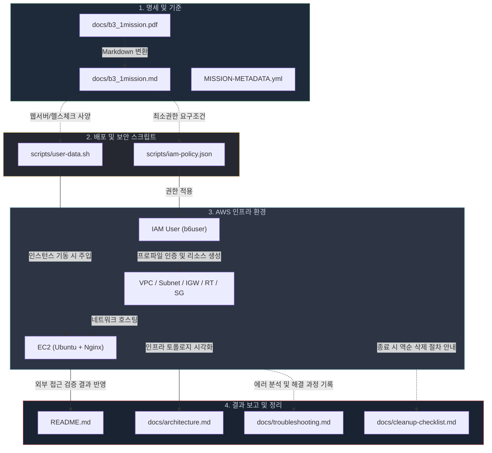
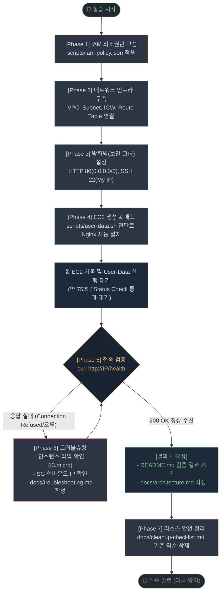
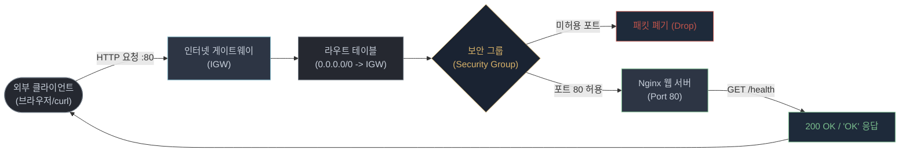
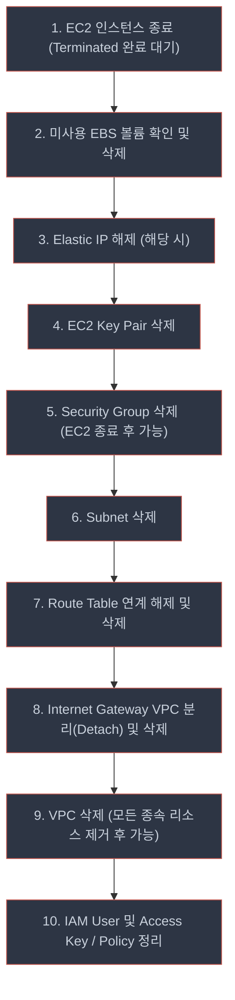

# B3-1 클라우드 인프라 구축 프로젝트 가이드 (`project.md`)

본 문서는 **B3-1 (AWS 웹 서비스 인프라 구축)** 과제의 전체 파일 구조, 구성 요소별 역할, 파일 간 상호 연관성, 전체 라이프사이클 순서도(Mermaid), 그리고 단계별 실행 순서를 총망라한 종합 가이드입니다.

---

## 1. 파일 트리 구조 (File Tree)

```text
/Users/mpeg46551/b3_1/
├── README.md                  # 프로젝트 메인 보고서 및 외부 접속 검증 결과
├── MISSION-METADATA.yml       # 미션 메타데이터 (미션 ID, 공식 명칭, 저장소 정보 등)
├── project.md                 # [본 문서] 프로젝트 구조, 파일 역할, 관계도, 실행 순서도 가이드
├── .gitignore                 # Git 추적 제외 목록 (Python, OS 임시파일, 민감 파일 등)
├── docs/                      # 프로젝트 명세서 및 제출 산출물 문서
│   ├── b3_1mission.pdf        # 과제 원본 요구사항 명세서 (PDF)
│   ├── b3_1mission.md         # 과제 원본 요구사항 명세서를 마크다운으로 변환한 문서
│   ├── architecture.md        # 아키텍처 구성도, IAM 구조도, 트래픽 흐름 시퀀스 (Mermaid)
│   ├── troubleshooting.md     # 실제 발생 오류에 대한 3건의 트러블슈팅 분석 보고서
│   └── cleanup-checklist.md   # 과금 방지를 위한 리소스 역순 정리 체크리스트 및 CLI 명령어
└── scripts/                   # 자동화 및 정책 스크립트
    ├── iam-policy.json        # IAM 사용자 최소권한 인라인 정책 정의 (JSON)
    └── user-data.sh           # EC2 인스턴스 초기 기동 시 Nginx 자동 설치/설정 스크립트
```

---

## 2. 파일별 역할 및 상세 설명

| 파일 경로 | 주요 역할 및 설명 |
|---|---|
| [README.md](file:///Users/mpeg46551/b3_1/README.md) | **프로젝트 메인 제출 문서**<br>- 인프라 환경 요약(서울 리전, t3.micro, Ubuntu 22.04 LTS, Nginx)<br>- 리소스 식별자(VPC, Subnet, IGW, Route Table, SG, EC2, IAM 유저)<br>- 방식 B(`GET http://54.180.237.44/health`) 외부 접속 검증 결과 및 curl 출력<br>- Security Group 인바운드/아웃바운드 규칙 요약 |
| [MISSION-METADATA.yml](file:///Users/mpeg46551/b3_1/MISSION-METADATA.yml) | **미션 메타데이터 정의**<br>- 현재 미션 ID(`B3-1`), 이전 미션 ID(`B6-1`) 매핑<br>- 공식 미션 명칭(`내가 만든 웹사이트를 인터넷에 올려 누구나 쓰게 하기`)<br>- 공식 저장소 및 컨트롤 타워 맵 URL 정보 |
| [docs/b3_1mission.pdf](file:///Users/mpeg46551/b3_1/docs/b3_1mission.pdf) | **과제 원본 PDF 요구사항 명세서**<br>- 미션 소개, 최종 4대 결과물 규격, 과제 목표, 기능 요구사항, 제약사항, 결과 예시 수록 |
| [docs/b3_1mission.md](file:///Users/mpeg46551/b3_1/docs/b3_1mission.md) | **마크다운 변환 미션 명세서**<br>- `b3_1mission.pdf`의 모든 텍스트, 표, 요구조건, 제약사항, 평가 기준을 완벽하게 마크다운 형태로 재구성하여 검색과 열람을 용이하게 함 |
| [docs/architecture.md](file:///Users/mpeg46551/b3_1/docs/architecture.md) | **아키텍처 상세 다이어그램 산출물**<br>- VPC 내부 서브넷, 라우트 테이블, 보안 그룹, EC2 토폴로지 다이어그램<br>- Root 계정과 IAM 유저 간 최소 권한 허용/차단 구조도<br>- 외부 Client 요청이 EC2 Nginx에 도달하고 200 응답을 반환하는 시퀀스 다이어그램 |
| [docs/troubleshooting.md](file:///Users/mpeg46551/b3_1/docs/troubleshooting.md) | **트러블슈팅 분석 보고서**<br>- 건 1: t2.micro 프리티어 오류 (`InvalidParameterCombination` 해결)<br>- 건 2: EC2 인스턴스 부팅 및 User-Data 실행 시차 대기 문제 해결<br>- 건 3: AWS SSO 프로파일과 직접 자격증명 IAM 유저 프로파일 충돌 방지 |
| [docs/cleanup-checklist.md](file:///Users/mpeg46551/b3_1/docs/cleanup-checklist.md) | **과금 방지 리소스 정리 가이드**<br>- AWS 자원 의존성 역순 정리 순서(EC2 → EBS → KeyPair → SG → Subnet → RT → IGW → VPC → IAM)<br>- 각 단계별 실행 가능한 정확한 AWS CLI 명령어와 체크리스트 수록 |
| [scripts/iam-policy.json](file:///Users/mpeg46551/b3_1/scripts/iam-policy.json) | **IAM 최소권한 정책 정의 파일**<br>- `AdministratorAccess`를 배제하고 실습에 필요한 EC2, VPC, Subnet, RouteTable, SecurityGroup, KeyPair, Address 등의 작업만 최소 허용 |
| [scripts/user-data.sh](file:///Users/mpeg46551/b3_1/scripts/user-data.sh) | **EC2 User-Data 부트스트랩 스크립트**<br>- 인스턴스 최초 실행 시 `apt update`, Nginx 패키지 설치<br>- `/health` 요청에 `200 OK`를 반환하도록 Nginx 기본 사이트 설정 자동화<br>- `/` 요청에 환영 HTML 페이지 응답 설정 및 서비스 활성화 |
| [.gitignore](file:///Users/mpeg46551/b3_1/.gitignore) | **버전 관리 제외 규칙**<br>- Python 바이트코드, 임시 캐시, 환경변수(`.env`), macOS 메타데이터(`.DS_Store`) 등 불필요하거나 민감한 파일의 Git 커밋 방지 |

---

## 3. 파일 간 관계 및 의존성 (File Relationships)

프로젝트 내 파일들은 **요구사항 정의(Specs) → 자동화 스크립트(Scripts) → 인프라 구축 및 검증 → 산출물 보고서(Docs)** 로 유기적으로 연결되어 있습니다.



---

## 4. 순서도 머메이드 차트 (Flowcharts)

### (1) 전체 인프라 구축 및 검증 라이프사이클 순서도



---

### (2) 외부 트래픽 처리 순서도 (Security Group & Nginx)



---

### (3) 리소스 역순 정리 의존성 순서도 (Deletion Dependency)

AWS 인프라 자원은 서로 결합되어 있으므로 **생성의 역순**으로 삭제해야 참조 에러(`DependencyViolation`)를 방지할 수 있습니다.



---

## 5. 실행 순서 상세 가이드 (Execution Order)

전체 작업은 아래의 7단계 순서대로 진행됩니다. 모든 AWS CLI 명령어는 서울 리전(`ap-northeast-2`)과 최소권한 프로파일(`--profile b6user`)을 기준으로 수행합니다.

### Phase 1: IAM 사용자 및 최소권한 정책 적용
- **목적**: 루트 계정 노출 방지 및 실습 최소 권한 원칙(Principle of Least Privilege) 준수
- **사용 파일**: [scripts/iam-policy.json](file:///Users/mpeg46551/b3_1/scripts/iam-policy.json)
- **주요 작업**:
  1. 루트 계정으로 IAM 유저(`codyssey-b6-user`) 생성
  2. `scripts/iam-policy.json`에 정의된 정책을 인라인 정책(`B6LabMinimumPrivilege`)으로 연결
  3. Access Key 발급 및 로컬 AWS CLI 프로파일 설정 (`aws configure --profile b6user`)

---

### Phase 2: 격리된 VPC 네트워크 환경 구축
- **목적**: 외부 인터넷과 분리된 독립 가상 사설망 및 인터넷 관문 연결
- **주요 작업**:
  1. **VPC 생성**: CIDR `10.0.0.0/16` 지정하여 VPC 생성
  2. **Public Subnet 생성**: CIDR `10.0.1.0/24`, 가용영역 `ap-northeast-2a` 지정
  3. **퍼블릭 IP 자동 할당 활성화**: 서브넷에 `MapPublicIpOnLaunch=true` 설정
  4. **Internet Gateway 생성 및 연결**: VPC에 IGW Attach
  5. **Route Table 구성**: 서브넷용 라우트 테이블 생성 후 `0.0.0.0/0 → IGW` 라우팅 규칙 추가 및 서브넷에 연결(Associate)

---

### Phase 3: 보안 그룹(Security Group) 접근 제어 규칙 설정
- **목적**: 침해사고 방지를 위한 최소 필요 포트 인바운드 허용
- **제약 사항**: 전체 포트(0-65535) 개방 금지, SSH는 특정 IP로 한정
- **주요 작업**:
  1. 보안 그룹 생성 (해당 VPC 지정)
  2. **HTTP (포트 80)**: `0.0.0.0/0` 허용 (웹 서비스 공개)
  3. **SSH (포트 22)**: 본인 공인 IP(`/32`)만 허용 (예: `121.135.181.35/32`)

---

### Phase 4: EC2 인스턴스 생성 및 애플리케이션 자동 배포
- **목적**: 프리티어 규격의 가상 서버 실행 및 Nginx 웹서버 자동 구동
- **사용 파일**: [scripts/user-data.sh](file:///Users/mpeg46551/b3_1/scripts/user-data.sh)
- **주요 작업**:
  1. SSH 접속용 Key Pair 생성 및 `.pem` 파일 로컬 저장 (`chmod 400`)
  2. EC2 실행 (`aws ec2 run-instances`):
     - AMI: Ubuntu 22.04 LTS 최신 AMI
     - 타입: `t3.micro` (프리티어)
     - 스토리지: EBS gp3 8 GiB
     - User Data: `--user-data file://scripts/user-data.sh` 전달
  3. 인스턴스 기동 완료 대기 (`aws ec2 wait instance-running` 및 `instance-status-ok`)

---

### Phase 5: 외부 접속 및 웹 서비스 검증
- **목적**: 외부에서 HTTP 통신이 정상적으로 도달하는지 증빙 확보
- **사용 파일**: [README.md](file:///Users/mpeg46551/b3_1/README.md)
- **검증 방식**: **방식 B** (`GET http://<퍼블릭IP>/health`)
- **실행 명령**:
  ```bash
  curl -i http://<퍼블릭IP>/health
  # HTTP/1.1 200 OK
  # Content-Type: text/plain
  # OK
  ```
- **산출물**: 응답 결과 및 스크린샷을 [README.md](file:///Users/mpeg46551/b3_1/README.md)에 기록

---

### Phase 6: 트러블슈팅 및 아키텍처 문서화
- **사용 파일**: [docs/troubleshooting.md](file:///Users/mpeg46551/b3_1/docs/troubleshooting.md), [docs/architecture.md](file:///Users/mpeg46551/b3_1/docs/architecture.md)
- **주요 작업**:
  1. 실습 중 발생했던 에러(인스턴스 타입 불일치, 부팅 지연, 프로파일 경합)에 대한 원인 가설 및 해결책을 6단계 포맷(`증상 → 가설 → 검증 → 조치 → 결과 → 재발방지`)으로 문서화
  2. 구축된 실제 리소스 ID를 바탕으로 Mermaid 아키텍처 다이어그램 및 시퀀스 다이어그램 작성

---

### Phase 7: 인프라 정리 및 과금 방지 (Cleanup)
- **목적**: 불필요한 과금 발생 원천 차단
- **사용 파일**: [docs/cleanup-checklist.md](file:///Users/mpeg46551/b3_1/docs/cleanup-checklist.md)
- **정리 순서**:
  1. EC2 인스턴스 Terminate 및 종료 상태 확인
  2. 미사용 EBS 볼륨 잔여 여부 확인
  3. Key Pair 및 Security Group 삭제
  4. Subnet 및 Route Table 삭제
  5. Internet Gateway 분리(Detach) 및 삭제
  6. VPC 삭제
  7. IAM User, Access Key, Inline Policy 삭제 (루트 계정으로 실행)
  8. AWS Billing Dashboard에서 잔여 과금 항목 최종 확인
